# How Creolytix Uses Codex, ChatGPT, GitHub Copilot, Greptile, Google Stitch, MCP, and Custom Skills to Deliver Software Safely and Effectively

## 1. Executive Summary

Creolytix uses a structured AI-assisted delivery model to improve how customer requirements are captured, translated into engineering work, implemented, reviewed, documented, and communicated to customers. Rather than relying on any single AI tool, we combine Codex, ChatGPT, GitHub Copilot, Google Stitch, Greptile, MCP servers, GitHub Boards, and internal controls such as the Creolytix Codex plugin and repo-local skills. The outcome is an end-to-end workflow that supports discovery, planning, design acceleration, implementation, pull request refinement, documentation, release communication, and customer-facing publication.

This model helps us move faster while also improving consistency, traceability, and quality. ChatGPT and Codex help convert raw customer discussions into structured requirements and actionable stories. Google Stitch accelerates UI exploration and design alignment. GitHub Copilot helps engineers implement approved work more efficiently. Greptile reviews pull requests with codebase context across frontend and backend boundaries. Codex also helps maintain repository documentation, prepare release notes, and support final publication to Intercom.

A critical part of our approach is governance. AI-assisted development becomes risky when every developer uses different prompts, different local agents, and different ungoverned skills. That leads to inconsistency in coding style, architecture decisions, design patterns, and security posture. To avoid that “wild west” model, Creolytix uses workspace-specific Codex plugins and repository-local skills to ensure developers operate with the same guardrails, engineering principles, and preferred delivery patterns.

This document explains the full operating model in detail. It covers how we capture customer requirements, plan user stories, split work into UI/UX, frontend, and backend issues, organize work in GitHub Boards, implement safely using Codex and Copilot, use Greptile to review pull requests, maintain repository documentation, prepare release notes, and publish final release communication to Intercom. It also explains how custom plugins, repo-local skills, and MCP integrations help us scale AI usage in a secure, standardized, and repeatable way.

```mermaid
flowchart LR
    A[Customer Inputs] --> B[ChatGPT and Codex Clarify Requirements]
    B --> C[Codex Creates Epics and User Stories]
    C --> D[Google Stitch Explores UI Concepts]
    C --> E[Codex Splits Work into UI/UX FE and BE Issues]
    D --> E
    E --> F[GitHub Boards Plans and Tracks Work]
    F --> G[Engineering Implements with Copilot Codex and Repo-Local Skills]
    G --> H[PR Created]
    H --> I[Greptile Reviews PR]
    I --> J[Codex Helps Refine PR]
    J --> K[Human Review and Approval]
    K --> L[Merged Changes]
    L --> M[Codex Updates Repository Documentation]
    L --> N[Codex Drafts Release Notes]
    N --> O[Stakeholder Review]
    O --> P[Publish to Intercom]
```


---

## 2. Objectives of the AI-Assisted Delivery Model

The purpose of our AI-assisted delivery model is not to replace the judgment of product managers, designers, architects, engineers, or reviewers. Its purpose is to improve delivery quality and execution speed by providing structured support at each stage of the software lifecycle. We use AI to assist in interpretation, planning, drafting, decomposition, analysis, refinement, and communication, while preserving human validation and approval at every critical stage.

One objective is to improve the quality of customer requirement capture. Many delivery delays and misunderstandings begin with ambiguity at the start of the process. By using ChatGPT and Codex to summarize conversations, identify assumptions, clarify goals, and propose follow-up questions, we can reduce confusion and produce clearer problem definitions before implementation begins.

A second objective is to improve planning quality. Codex helps transform approved requirements into epics, user stories, and implementation-ready issues. This reduces ambiguity, improves acceptance criteria, and makes it easier for product and engineering teams to align on what should be built and how work should be sequenced.

A third objective is to accelerate design and engineering alignment. Google Stitch helps transform written requirements into visual concepts, while Codex helps decompose work into UI/UX, frontend, and backend streams. This creates a more parallel, coordinated execution model.

A fourth objective is to improve implementation quality and pull request refinement. GitHub Copilot helps engineers with day-to-day coding tasks. Greptile helps review pull requests with awareness of broader codebase context. Codex helps interpret review findings and propose refinements. Together, these tools reduce friction and improve consistency in code quality.

A fifth objective is to improve operational clarity after implementation. We use Codex to help update repository documentation, summarize changes, draft release notes, and support customer-facing publication through Intercom. This makes release communication more repeatable and keeps documentation more closely aligned with what was actually built.

A critical objective across all of this is standardization at scale. AI-assisted development can become fragmented if every developer creates their own prompting style, local coding agent setup, and personal library of undocumented skills. That leads to inconsistent outcomes and increased governance risk. Creolytix addresses this by using workspace-specific Codex plugins and repo-local skills so teams work inside a shared operating model defined by common design patterns, coding principles, security guardrails, and delivery expectations.

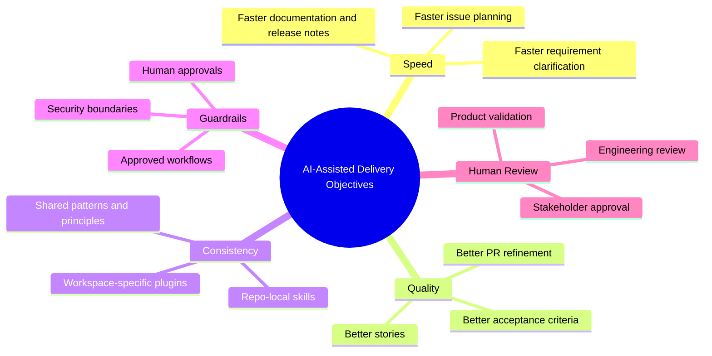


---

## 3. Tooling Landscape

### 3.1 Codex

Codex is one of the core engines in our AI-assisted delivery model. We use it to convert raw requirements into structured planning artifacts, draft epics and stories, break those stories into implementation issues, prepare documentation, interpret pull request feedback, and draft release notes. Codex is especially useful when paired with predefined prompts, repo-local skills, and controlled context, because that allows us to generate outputs that are both repeatable and aligned with our internal ways of working.

Codex is not used as an unbounded autonomous coding system. Instead, it is used as a guided delivery assistant that operates inside defined workflows and review expectations. Its value comes not only from speed, but from its ability to generate useful outputs within the boundaries of our standards and repository context.

### 3.2 ChatGPT

ChatGPT is used primarily in the earlier and more exploratory phases of work. It is helpful when product, architecture, or customer-facing teams need support summarizing a conversation, brainstorming options, refining wording, surfacing ambiguity, or generating clarifying questions. In many cases, ChatGPT is the tool we use to convert raw human discussion into a more structured understanding of a problem before the work is formalized through Codex and workflow-specific skills.

ChatGPT is also useful for producing cleaner internal communication. It can refine product narratives, rewrite rough notes into professional summaries, simplify complex explanations, and improve customer-facing language for release communications.

### 3.3 GitHub Copilot

GitHub Copilot is used inside the engineering workflow to assist with implementation after work has already been defined and approved. Engineers use it for scaffolding code, generating test cases, refactoring repetitive logic, accelerating boilerplate creation, and suggesting code completions during development. Its value is highest when the work has already been scoped clearly through issues, design decisions, and engineering context.

Copilot is not treated as the source of truth for design or architecture. It is most effective when used in combination with well-written issues, repo-local skills, and workspace-standardized AI behaviors.

### 3.4 Greptile

Greptile is used as a codebase-aware review tool in the pull request lifecycle. Its role is to analyze proposed changes in the context of surrounding repository patterns, shared contracts, and cross-file relationships rather than only looking at isolated changed lines. This allows Greptile to provide more meaningful review feedback on correctness, maintainability, consistency, and architectural fit.

In our environment, Greptile is especially useful for repositories where frontend and backend code are tightly related. By considering both FE and BE context, as well as shared models and API boundaries, Greptile can identify issues that might otherwise escape a narrower review flow.

### 3.5 Creolytix Codex Plugin

The Creolytix Codex plugin provides an internal control layer that standardizes how Codex is used across our workspace. Rather than letting every team define its own agent behavior, prompting patterns, or tool usage conventions, the plugin creates a shared operating model for AI-assisted work. It helps us ensure that the same expectations around safety, style, workflow, and review are applied consistently.

A major benefit of a workspace-specific plugin is that it reduces uncontrolled drift. Without shared controls, AI-assisted development quickly fragments into inconsistent prompting styles, uneven guardrails, and local variations in how engineering decisions are supported. By configuring Codex at the workspace level, Creolytix ensures that developers are guided by the same principles, patterns, and operational constraints.

### 3.6 Repo-Local Skills

Repo-local skills are structured AI capabilities intentionally constrained to a particular repository, codebase, domain, role, or workflow. These skills help keep AI outputs relevant and aligned with repository-specific architecture, naming conventions, design patterns, coding standards, review expectations, and security requirements. They reduce prompt noise and improve the consistency of output across contributors.

Repo-local skills are also one of the most important controls we have against local AI sprawl. If every developer invents a different set of personal prompts and local agent behaviors, the result is inconsistent code and process fragmentation. By defining skills at the repository level, we ensure that developers working in the same codebase are guided by the same principles and the same implementation expectations.

### 3.7 MCP Servers

MCP servers allow AI tools to access trusted, structured external context in a more controlled way. This is especially important when teams want AI assistance that reflects the latest official syntax, APIs, documentation, and platform behavior. In our environment, MCP helps bridge the gap between a general-purpose model and authoritative, current technical sources.

A practical example is modern .NET development. By configuring MCP connections to trusted official .NET sources, we can help ensure that Codex or related tools produce suggestions aligned with current C# syntax and contemporary framework practices. This reduces reliance on stale assumptions and improves confidence that generated guidance matches the latest official ecosystem direction.

### 3.8 Google Stitch

Google Stitch is used to accelerate UI ideation and early design exploration. It helps teams move from written product requirements to draft user interface concepts, flows, and interaction patterns much faster than a fully manual process. This is particularly helpful in the early phase of feature planning when product, design, and frontend stakeholders need a visual starting point to discuss.

Stitch is not a replacement for human design expertise. It is a design acceleration tool that helps us get to a shared visual conversation faster. Human designers and frontend engineers still evaluate the generated concepts, refine them, challenge them, and decide what is appropriate to carry forward into implementation planning.

### 3.9 Intercom

Intercom is the final publication channel in our release communication workflow. Once release notes have been drafted, refined, validated, and adapted for customer-facing language, they are published to Intercom so customers can understand what has changed and why it matters.

Intercom publication is not treated as an isolated marketing step. It is part of the delivery lifecycle. The clarity and quality of release notes influence customer understanding, adoption, and trust, so this part of the workflow is treated with the same emphasis on structure and review as earlier delivery phases.

### 3.10 GitHub Boards and Repository Workflows

GitHub Boards and repository issue workflows are where planned work becomes structured, visible, and traceable. AI-generated outputs only become useful when they are turned into actionable items that teams can prioritize, assign, review, and complete. GitHub Boards gives us the planning and sequencing layer that connects requirements, issues, implementation, and release outcomes.

We use GitHub Boards to organize the issues created from epics, stories, UI/UX work, frontend tasks, backend tasks, and follow-up actions. This gives teams a common place to understand status, dependency flow, ownership, and execution progress across the development lifecycle.

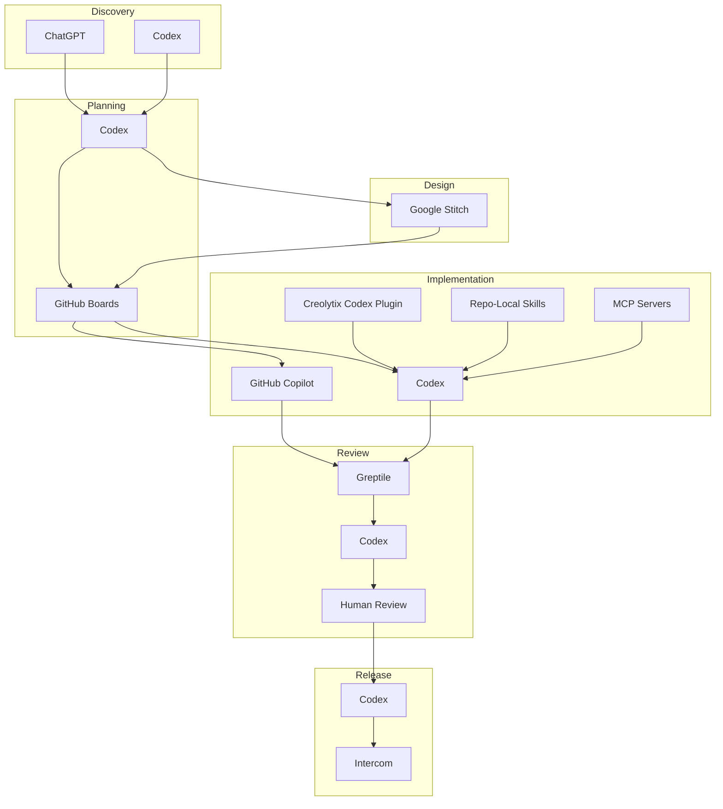


---

## 4. End-to-End Workflow Overview

Our end-to-end workflow starts with customer input. These inputs can come from meetings, workshops, support conversations, stakeholder requests, emails, and product discussions. At this stage the information is often incomplete, ambiguous, or expressed in business language rather than implementation language. ChatGPT and Codex are used first to summarize, clarify, and structure these inputs into an understandable problem definition.

Once a requirement has been clarified and validated, Codex helps convert it into epics and user stories. Those stories are then decomposed into multiple issue streams, including UI/UX issues, frontend issues, and backend issues. If the feature has a user-facing dimension, Google Stitch is used to accelerate visual ideation and improve alignment between product, design, and engineering. The issues generated from this process are then organized and tracked in GitHub Boards.

Implementation begins once the work is sufficiently ready. Engineers use GitHub Copilot during day-to-day coding, while Codex and repo-local skills help reinforce repository-specific standards and patterns. Pull requests are opened and reviewed using a mix of human review and Greptile. Greptile contributes codebase-aware review feedback, and Codex can help interpret review findings and refine proposed changes.

After work is merged, the process does not stop. Codex helps update repository documentation where needed, summarize changes, and draft release notes from merged work and related issues. Those release notes are then reviewed and adapted for customer-facing communication before publication in Intercom. This completes the loop from customer request to customer communication.

This workflow matters because it shows that AI usage is not isolated to coding. It is embedded across the entire lifecycle: discovery, planning, design, implementation, review, documentation, and release communication. That end-to-end integration is what gives the model its real value.

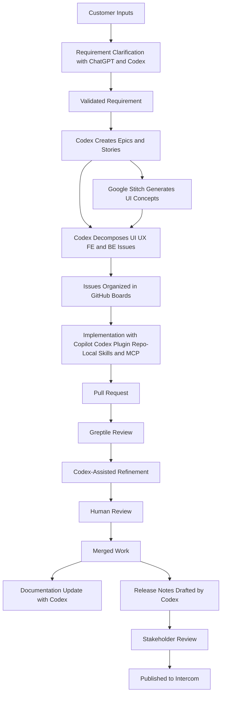


---

## 5. Capturing and Structuring Customer Requirements

Customer requirements often begin in forms that are difficult to work with directly. They may be spread across meeting transcripts, email threads, Slack discussions, support requests, or verbal conversations. Important implementation constraints may be implied rather than stated. Stakeholders may focus on desired outcomes without articulating edge cases, dependencies, or non-functional requirements. If this ambiguity is not addressed early, it creates downstream confusion in planning and development.

We use ChatGPT and Codex to help convert this raw material into a clearer requirement package. This includes summarizing what the customer is trying to achieve, identifying relevant user personas, extracting explicit goals and constraints, surfacing assumptions, and proposing questions that still need answers. This structured interpretation helps product and engineering teams decide whether the requirement is ready for planning or whether further clarification is needed.

At this stage, human validation remains essential. AI can help surface useful structure, but the final understanding of the requirement must still be reviewed by the people responsible for the product direction and delivery commitments. The purpose of AI here is not to decide what the customer wants, but to accelerate the path from unstructured input to a reviewable requirement.

It is useful to think of this stage as risk reduction. A large share of delivery problems arise not from coding mistakes but from misinterpreted intent. By using AI to make assumptions, ambiguity, and missing details more visible early in the process, we reduce the likelihood of downstream misalignment.

### Typical Inputs
- Customer discovery meetings
- Emails and written requests
- Support tickets and issue escalations
- Stakeholder interviews
- Product workshops
- Implementation feedback from existing users

### Typical Outputs
- Structured problem statement
- Summary of business goals
- Identified user personas
- Constraints and assumptions
- Open questions for clarification
- Decision on readiness for planning

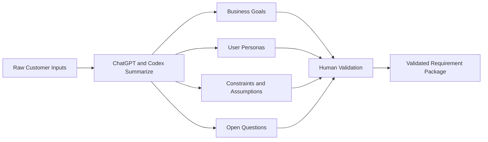


---

## 6. Using Codex and ChatGPT to Plan Epics and User Stories

Once a customer requirement has been clarified and approved, the next step is to convert it into planning artifacts that the delivery team can work with. Codex is used to draft epics and user stories that express the requirement in a structured and execution-friendly form. These stories focus on user value, expected outcomes, acceptance criteria, dependencies, and implementation boundaries.

ChatGPT can complement this stage by improving clarity, refining wording, or generating alternate versions of a story for different audiences. A story may need one formulation that works well for product review and another that is more engineering-focused. Used together, ChatGPT and Codex help us move from a validated business requirement to a clearer planning model.

A strong user story is more than a sentence stating a feature. It should establish who benefits, what they need, why it matters, what edge cases matter, how success is judged, and what assumptions are still in play. Codex is useful here because it can suggest acceptance criteria, identify missing scenarios, and highlight dependencies that might otherwise be overlooked.

The end goal of this stage is to reach a definition-of-ready state where work is sufficiently understood to be broken down further into execution streams. Product managers and engineering leads still review these outputs to ensure they are realistic, scoped appropriately, and consistent with the roadmap. AI helps us get there faster, but it does not remove planning accountability.

### Typical Outputs
- Epics
- User stories
- Acceptance criteria
- Edge case lists
- Dependency mapping
- Definition-of-ready review notes

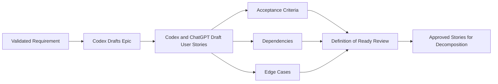


---

## 7. Using Google Stitch to Accelerate UI Design

Many product requirements benefit from early visual thinking. Written requirements often describe intended behavior or user value, but they do not always make the interaction model obvious. This is where Google Stitch becomes useful. Stitch helps us convert textual requirements into draft UI ideas, layouts, and flows so teams can align visually before implementation begins.

This is especially important for collaboration between product, design, and frontend engineering. A requirement may seem clear in prose but still conceal ambiguity around layout, screen states, navigation flow, form design, or interaction logic. Stitch gives teams a starting point that makes those questions visible earlier.

We use Stitch as a design acceleration layer, not as a final design authority. The outputs it produces are reviewed and refined by human designers and frontend engineers. They may identify accessibility issues, missing states, interaction gaps, or opportunities to simplify the experience. This human refinement step is essential because speed in generating concepts does not replace design judgment.

Once the visual direction has matured, the output of this phase supports issue decomposition. UI/UX issues can focus on refinement and design details, while frontend issues can focus on the implementation of approved screens, states, and interactions. In that way, Stitch strengthens the bridge between product intent and engineering execution.

### Typical Uses of Stitch
- Visualizing screens early in planning
- Exploring alternate UI flows
- Generating initial layout ideas
- Improving product, design, and FE alignment
- Making missing states visible earlier

### Human Review Areas
- Accessibility
- UX consistency
- Empty, loading, and error states
- Navigation clarity
- Mobile and responsive considerations
- Alignment with design system standards

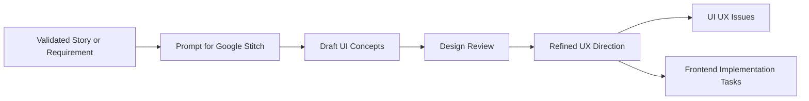


---

## 8. Segmenting Work into UI/UX, Frontend, and Backend Issues

A single user story rarely maps cleanly to a single implementation task. Effective delivery usually requires decomposing the work into multiple issue streams that reflect different disciplines and technical concerns. At Creolytix, we segment work into UI/UX issues, frontend issues, and backend issues so each stream has clear scope, ownership, and expectations.

UI/UX issues typically cover flows, states, layout decisions, interaction patterns, accessibility concerns, validation expectations, and visual refinement. Frontend issues focus on implementing components, screens, client-side state handling, API integration, and user interaction logic. Backend issues focus on business rules, APIs, services, data persistence, validation, authorization, performance, observability, and cross-system integration where needed.

Codex helps create this decomposition in a consistent way. Once a story exists, Codex can propose issue splits that reflect the actual work required rather than leaving teams to infer the decomposition manually every time. This makes planning more repeatable and helps reduce the mismatch between story scope and implementation reality.

Human review is still required, particularly to validate whether the split is appropriate, whether any tasks are missing, and whether ownership and sequencing make sense. Once the issues are validated, they are organized in GitHub Boards so teams can coordinate execution across product, design, frontend, and backend contributors.

This decomposition model is important because it enables parallelism without losing traceability. Each issue remains connected to the broader story, but teams can move independently where appropriate and still maintain a shared understanding of how the parts fit together.

### Examples of UI/UX Issues
- Create or refine flow for onboarding step
- Define empty and loading states
- Update accessibility behavior for form validation
- Align design to approved interaction pattern

### Examples of Frontend Issues
- Implement screen and reusable components
- Integrate API response into UI state
- Add client-side validation and error handling
- Wire analytics events to interaction points

### Examples of Backend Issues
- Create or update API endpoint
- Add validation rules and authorization checks
- Persist new data model fields
- Extend logging and observability for new workflow

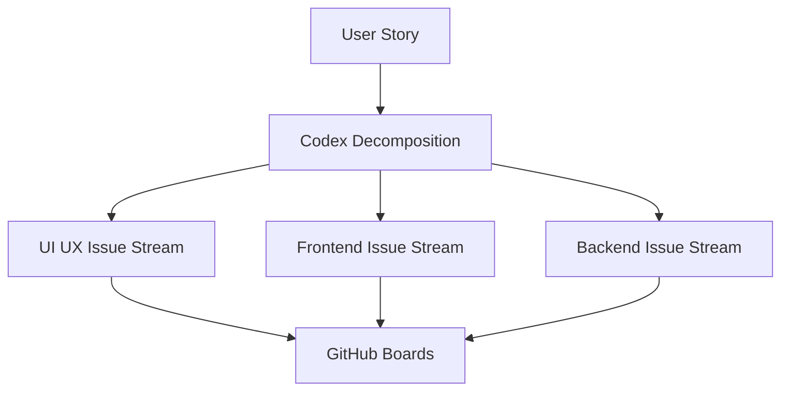


---

## 9. AI-Assisted Issue Writing and GitHub Boards Planning

Product managers often know what they want to achieve but may not always have the time or structure to write implementation-ready issues consistently. Codex helps bridge that gap by drafting GitHub issues that contain a clear problem statement, business context, acceptance criteria, dependencies, assumptions, and relevant implementation notes. This creates a stronger handoff to engineering and reduces ambiguity in planning.

High-quality issue writing matters because poor issues create confusion, rework, and repeated clarification cycles. If acceptance criteria are vague or context is missing, engineers must reconstruct intent later, often under time pressure. Codex helps improve consistency by using structured issue-writing approaches that encourage completeness and clarity.

These issues are then placed into GitHub Boards, where they can be prioritized, sequenced, assigned, and tracked. GitHub Boards becomes the operational layer where structured work is made visible across the team. The combination of Codex-generated issue quality and board-based workflow management creates a more reliable planning process.

We also see strong value in creating dedicated skills for product managers. These skills help ensure that issue writing follows consistent organizational patterns and avoids becoming a free-form prompt exercise. That means product teams are not just using AI casually; they are using curated, repeatable workflows that produce better planning artifacts.

### Benefits of AI-Assisted Issue Writing
- More consistent issue structure
- Better acceptance criteria
- Faster planning handoff
- Reduced ambiguity for engineering
- Better traceability into GitHub Boards
- Easier prioritization and sequencing


---

## 10. Using Skills to Support Architects and System Designers

AI is also useful for architecture and system design work when it is guided carefully. Architects can use Codex together with structured skills to break down requirements into service boundaries, interface contracts, integration patterns, risk areas, and design alternatives. This is valuable because architectural exploration often involves comparing tradeoffs, identifying coupling, and reasoning about change impact across multiple components.

A skill-driven approach is especially important in architecture because free-form AI usage can easily become too generic. By defining skills that focus on our technology stack, domain patterns, quality expectations, and preferred design principles, we make AI assistance more relevant and less noisy. Skills can prompt for scalability concerns, failure modes, performance considerations, security risks, and operational implications.

Architecture skills can also help standardize how options are presented. For example, they can encourage output that compares multiple approaches, identifies pros and cons, highlights dependencies, and recommends an option based on explicit reasoning. This improves the quality of architecture discussions without pretending that the AI is the architect.

We can take inspiration from public skill-driven approaches such as the examples in `gstack`, while tailoring our own skills to our domain and repositories. Over time, this creates a reusable architecture assistance model that improves consistency in system thinking across teams.

### Example Architecture Skill Categories
- System decomposition
- Service boundary definition
- API and contract analysis
- Tradeoff comparison
- Failure mode exploration
- Security and scalability review

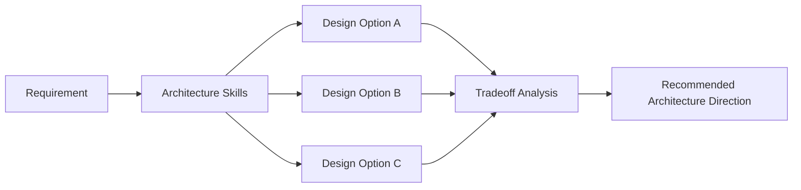


---

## 11. Creolytix Codex Plugin, Workspace-Specific Controls, and Safe Coding Guardrails

The Creolytix Codex plugin is a central part of our governance model. Its purpose is not merely convenience. It exists to make AI usage safer, more consistent, and more aligned with enterprise delivery expectations. Rather than allowing unrestricted and highly individualized use of AI, the plugin provides a shared operating model for how Codex is used across the workspace.

Workspace-specific plugin behavior matters because AI-assisted development can become chaotic very quickly if every developer configures their own local agent patterns, prompting styles, and informal skill sets. Without standardization, teams can drift into inconsistent coding conventions, inconsistent architectural decisions, uneven security posture, and variable review quality. The result is not speed, but fragmentation.

By defining a workspace-specific plugin, Creolytix ensures that AI interactions are guided by a common set of principles. These include preferred delivery patterns, coding expectations, review assumptions, safe operating boundaries, and organizational constraints. This helps all contributors operate within the same framework instead of building a collection of disconnected local AI habits.

Repo-local skills extend this control model further. They ensure that AI support is not just standardized globally but also aligned with the needs of a specific codebase. A repository can define its own preferred architecture patterns, naming standards, domain concepts, test expectations, documentation norms, and review rules. Skills allow those repository-specific expectations to be encoded into the assistance model.

This is how we avoid the “wild west” of AI-assisted software development. We do not want a world where every developer has a different coding agent philosophy, a different prompt library, and a different set of undocumented shortcuts. That creates chaos, makes reviews harder, increases risk, and undermines maintainability. Instead, we want a governed environment where AI assistance reflects shared patterns, shared guardrails, shared principles, and shared accountability.

These controls do not eliminate human responsibility. They make human review more effective by reducing variance, improving predictability, and increasing alignment. Human reviewers still validate code, architecture, security, documentation, and release outputs. The plugin and skill model simply ensure that the starting point is much closer to the organization’s expectations.

### Why Workspace-Specific Plugins Matter
- Standardize AI usage across teams
- Reduce prompt drift and local variance
- Reinforce common engineering principles
- Improve safety and reviewability
- Avoid ad hoc local agent sprawl

### Why Repo-Local Skills Matter
- Encode repository-specific patterns
- Keep outputs aligned with local architecture
- Improve consistency in implementation
- Support safer and more predictable coding
- Reduce localized skill chaos

### Example Guardrail Areas
- Repository scope restrictions
- Approved workflows and task types
- Required review checkpoints
- Prompt and skill curation
- Domain-specific constraints
- Documentation and release standards

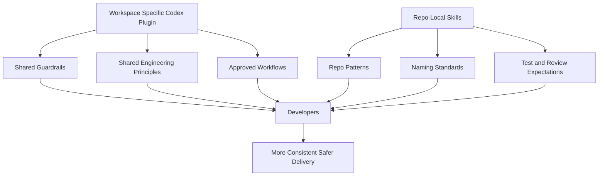

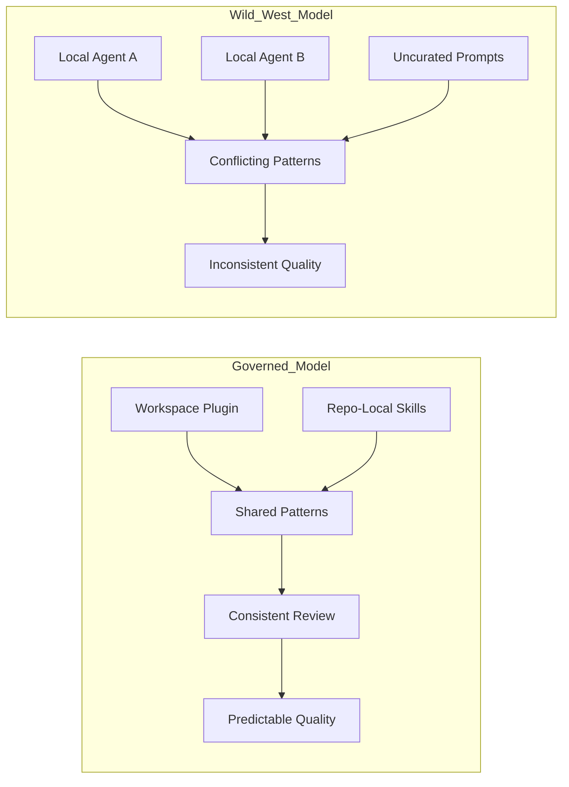


---

## 12. How GitHub Copilot Is Used in Engineering Delivery

GitHub Copilot plays a tactical role inside the engineering workflow. Once work has been defined through requirements, issues, and design context, engineers use Copilot to help accelerate code implementation. This includes generating boilerplate, suggesting refactorings, drafting tests, completing repetitive patterns, and assisting with routine coding tasks.

The value of Copilot is highest when it is paired with strong planning and contextual guidance. If the story is vague or the repository conventions are unclear, Copilot suggestions can become inconsistent or less useful. But when engineers are working from clear GitHub issues, aligned design context, and repository-specific patterns, Copilot becomes a strong productivity amplifier.

In our delivery model, Copilot is not an independent design engine. It is an implementation assistant. It works best when the heavy thinking around requirements, decomposition, and standards has already been done. That is why Copilot fits naturally after planning, not before it.

Copilot also benefits from the broader governance model created by workspace-standardized Codex behavior and repo-local skills. That governance does not directly replace Copilot, but it shapes the engineering environment in which Copilot is used. Developers therefore code with more consistent expectations around patterns, architecture, tests, and review quality.

### Typical Copilot Use Cases
- Code scaffolding
- Test generation
- Refactoring assistance
- Boilerplate generation
- Repetitive logic completion
- Accelerating implementation of approved tasks

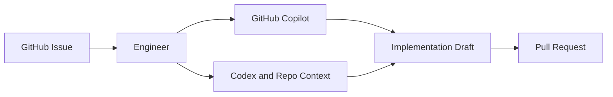


---

## 13. How MCP Servers Improve Modern Development Workflows

MCP servers improve AI-assisted development by connecting models to trusted external sources of truth. This matters because software development is highly sensitive to version drift, documentation changes, framework evolution, and language improvements. A model operating without current trusted context may provide syntactically valid but outdated or suboptimal guidance.

In our environment, MCP can be configured to connect to official .NET-related sources so coding assistance reflects current C# syntax, framework capabilities, and recommended platform usage. This helps reduce the risk of generating stale patterns and improves the relevance of AI suggestions for teams working in modern .NET codebases.

This is particularly important in enterprise settings where engineering quality depends on consistency with official standards and where outdated patterns can have long-term maintenance impact. MCP helps ground AI support in authoritative context instead of relying only on model memory or generalized assumptions.

MCP does not eliminate the need for engineering judgment. It improves the quality of context available to the AI, which in turn improves the quality of output. Human engineers still decide whether a suggested pattern is appropriate for the repository, the architecture, and the business need.

### Example MCP Benefits
- Better alignment with latest C# syntax
- More current framework usage patterns
- Reduced stale or outdated recommendations
- More trustworthy coding assistance
- Better fit for enterprise development standards

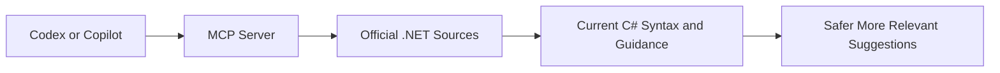


---

## 14. How Greptile Is Configured to Review Pull Requests

Greptile is configured as part of the pull request review lifecycle to provide codebase-aware automated review feedback. Instead of limiting analysis to changed lines only, Greptile considers surrounding files, shared contracts, architecture patterns, and historical context where applicable. This helps make its review findings more meaningful and actionable.

A key part of configuring Greptile well is ensuring that it has access to enough repository context to reason across frontend and backend boundaries. In many features, the real risks are not isolated inside one layer. They emerge at the seams between UI behavior, frontend logic, API contracts, backend business rules, and shared models. Greptile becomes much more effective when it can see those relationships.

This is why full-stack context matters. In repositories that include both FE and BE logic, Greptile should be able to reason about shared types, request and response contracts, integration assumptions, and behavior across multiple files. That allows it to catch mismatches that could otherwise slip through code review.

Greptile’s role is not to replace human reviewers but to enhance them. It helps identify issues earlier, surface consistency concerns, and point engineers toward risks that deserve attention. It becomes even more useful when its findings are fed back into a refinement workflow with Codex.

### Important Greptile Review Context
- Frontend and backend code relationship
- Shared contracts and models
- API request and response alignment
- Cross-file logic dependencies
- Architectural consistency
- Maintainability and potential regressions

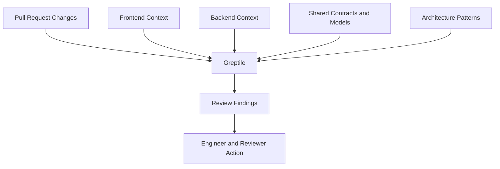


---

## 15. How Codex and Greptile Work Hand in Hand to Refine Pull Requests

Codex and Greptile work best when treated as a feedback loop rather than two disconnected tools. Codex can help an engineer prepare a pull request by improving code clarity, tests, naming, documentation, and summary text. Once the PR is opened, Greptile reviews it in codebase context and identifies possible issues, inconsistencies, and risks.

At that point, Codex becomes useful again. Instead of leaving engineers to manually interpret every Greptile finding from scratch, Codex can help explain the comments, propose fixes, suggest test adjustments, or update supporting documentation. This makes review response faster and more consistent.

This loop is especially powerful because it combines different strengths. Greptile is effective at structured codebase-aware review, while Codex is effective at turning review feedback into concrete next actions. Together, they help teams refine PRs more efficiently before final human approval.

This process still depends on human validation. Not every automated review finding is correct, and not every AI-proposed fix is appropriate. The goal is not to automate away judgment, but to improve the quality and speed of iteration between implementation and final review.

### PR Refinement Loop
1. Engineer creates PR
2. Greptile reviews PR in repository context
3. Codex helps interpret findings
4. Engineer updates code, tests, or docs
5. Human reviewers validate changes
6. PR moves toward approval and merge

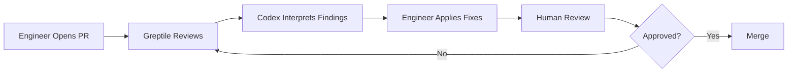


---

## 16. Using Codex to Write and Maintain Repository Documentation

Documentation is often one of the first things to lag behind when teams are under delivery pressure. Codex helps us close that gap by assisting with README updates, onboarding instructions, setup documentation, architecture notes, module descriptions, API usage guidance, and change summaries. It helps translate implementation changes into documentation candidates more quickly than a fully manual process.

This is useful because documentation quality directly affects maintainability, onboarding, and cross-team understanding. When documentation reflects what the code actually does, repositories become easier to work in and future changes become easier to make. Codex helps by reducing the friction of keeping documentation current.

As with other parts of the workflow, documentation assistance is governed and reviewed. AI can propose text and structure, but technical owners still validate correctness, completeness, and clarity. Documentation that is fast but inaccurate is not helpful, so review remains important.

By making documentation a standard part of the AI-assisted delivery loop, Creolytix treats repository clarity as part of engineering quality rather than as an optional afterthought.

### Common Documentation Targets
- README files
- Setup and onboarding guides
- Architecture summaries
- Module-level documentation
- API usage notes
- Change summaries and migration guidance

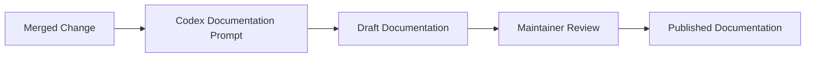


---

## 17. Using Codex to Prepare Release Notes

Release notes are a natural fit for AI assistance because they require synthesizing many changes into a smaller set of understandable messages. Codex helps us collect information from merged pull requests, issue summaries, feature changes, and repository activity so we can draft release notes more quickly and consistently.

One important part of this process is translation. Engineers often describe changes in technical terms, but customers need to understand value and impact. Codex helps convert technical work into clearer customer-facing wording while still preserving enough accuracy for review.

We can also use Codex to generate multiple forms of release output. One version may be more internal and engineering-focused, while another is shorter and better suited for customer communication. This flexibility reduces manual rewriting effort and improves communication consistency across audiences.

Human review still determines what is included, how it is phrased, and whether the final message is accurate. The role of AI is to accelerate synthesis and drafting, not to decide the final public narrative on its own.

### Typical Release Note Inputs
- Merged PRs
- Closed issues
- Feature summaries
- Bug fix descriptions
- Change labels and categories
- Stakeholder review comments

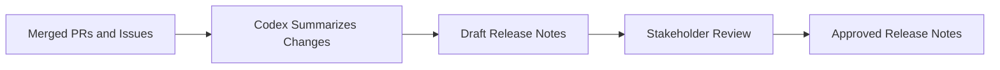


---

## 18. Publishing Release Notes to Intercom

After release notes are drafted and approved, they move into the publication stage. Intercom is used as the final customer-facing delivery channel for release communication. At this stage, the content is adapted to suit the tone, structure, and clarity expected in customer communication.

This step may appear simple, but it is important. The same content that works in an internal engineering changelog may not work well in a customer-facing release announcement. Customers need concise, value-oriented messaging that explains what changed and why it matters without unnecessary implementation detail.

Codex helps reduce effort earlier in the release process so the publication stage can focus more on polishing, validation, and customer readability. Product, marketing, support, or customer success stakeholders may all participate in this final review depending on the type of release.

Treating release note publication as part of the overall software delivery workflow ensures customer communication is not left disconnected from planning and implementation. It reinforces the idea that delivery is not complete until changes are communicated clearly.

### Publication Considerations
- Customer-friendly tone
- Clear articulation of value
- Removal of unnecessary technical detail
- Approval by appropriate stakeholders
- Consistent formatting and structure
- Final validation before publication

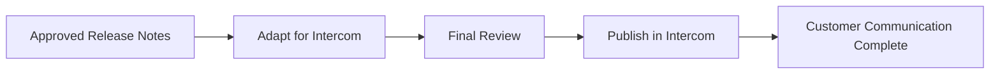


---

## 19. Example Skill Catalog

A mature AI-assisted delivery environment should not depend on every individual inventing prompts from scratch. It should provide a catalog of curated, reusable skills aligned to the needs of different roles and workflows. At Creolytix, such a catalog can include skills for product managers, architects, UI/UX planning, frontend decomposition, backend decomposition, documentation generation, PR refinement, and release note preparation.

For product managers, skills can help convert customer discovery notes into structured issues, draft better acceptance criteria, and create clearer GitHub Board-ready planning items. For architects, skills can support system decomposition, tradeoff analysis, interface definition, and risk framing. For design-oriented workflows, skills can help generate better prompts for Stitch and improve the handoff from concept to implementation.

For engineering, skills can help break stories into FE and BE implementation tasks, interpret review findings, and generate documentation updates. For release management, skills can help prepare internal and external release notes. The common theme is reuse and standardization.

The skill catalog should be curated, versioned, and governed. Without that, it becomes another source of fragmentation. With governance, it becomes a practical mechanism for scaling consistent AI usage across many contributors and repositories.

### Example Skill Categories
- PM requirement-to-issue skill
- User story generation skill
- UI concept prompting skill for Stitch
- FE task decomposition skill
- BE task decomposition skill
- Architecture tradeoff analysis skill
- PR feedback interpretation skill
- Documentation drafting skill
- Release note drafting skill

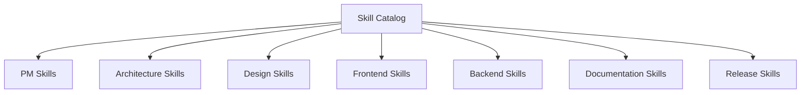


---

## 20. Governance, Security, and Human Oversight

AI assistance is only sustainable in an enterprise environment if it is governed properly. At Creolytix, governance means AI is used inside a framework of review, accountability, security, and standardization. Requirements, architecture, code, documentation, GitHub issues, GitHub Boards planning, and release communication all remain subject to human validation and approval.

A major governance principle is the avoidance of unstructured local AI sprawl. If every developer defines their own local skills, their own coding agent habits, and their own unreviewed prompting patterns, the result is inconsistency across design, implementation, security, and review quality. That undermines the predictability and maintainability needed for team-scale engineering.

Workspace-specific Codex plugins and repo-local skills are important precisely because they prevent this sprawl. They create common operating boundaries and common expectations. They ensure developers working in the same environment are guided by the same patterns and principles rather than improvising incompatible AI workflows.

Security and auditability are also essential. Teams must be mindful about how customer data is used, what context is exposed to tools, what outputs are trusted, and what review steps are required before generated work is accepted. Governance is not a layer on top of the model. It is built into the model.

In practice, this means we treat AI as an assistant inside a controlled delivery system, not as an independent actor. That framing helps us preserve the benefits of speed while reducing the risks of inconsistency, overreach, and poor-quality output.

### Governance Principles
- AI assists, humans decide
- Workspace-level standardization matters
- Repo-local skills reduce inconsistency
- Human review remains mandatory
- Security and auditability are foundational
- Quality is improved through controlled reuse, not free-form chaos

```mermaid
flowchart TB
    A[AI Assistance] --> B[Human Review]
    A --> C[Security Boundaries]
    A --> D[Workspace Standards]
    A --> E[Repo-Local Skills]
    A --> F[Auditability]
    B --> G[Approved Output]
    C --> G
    D --> G
    E --> G
    F --> G
```


---

## 21. Benefits, Limitations, and Future Improvements

This delivery model brings several benefits. It helps teams move faster from customer request to implementation, improves the quality of requirements and issues, accelerates UI exploration, strengthens PR review, supports better documentation hygiene, and improves the consistency of release communication. By embedding AI support across the lifecycle rather than in isolated steps, we create a more connected and efficient operating model.

Another major benefit is consistency. Workspace-specific plugins and repo-local skills help ensure contributors generate work using shared patterns and principles instead of fragmented local AI practices. This makes code easier to review, systems easier to maintain, and team collaboration easier to scale.

There are also limitations. AI outputs still require validation. Poor context produces poor results. Review tools can produce false positives. Generated UI concepts can still miss usability nuances. Suggested code can still be wrong. None of these tools eliminate the need for product judgment, design expertise, engineering discipline, or responsible review.

That said, the model can continue to improve. Future improvements may include richer skill libraries, deeper MCP integrations, stronger multi-repository context support, more advanced full-stack review workflows, better automation around documentation refresh, and more refined release communication pipelines.

The long-term goal is not to maximize automation for its own sake. It is to create a high-trust, high-consistency, high-leverage AI-assisted delivery model that helps teams do better work with more clarity and less friction.

### Key Benefits
- Faster requirement-to-delivery flow
- Better issue quality
- Improved design and engineering alignment
- Stronger PR review and refinement
- Better documentation maintenance
- More consistent release communication

### Key Limitations
- AI still requires human review
- Output quality depends on context quality
- False positives are possible in review tooling
- Design and architecture still need expert judgment
- Governance discipline is essential

### Future Improvements
- Expand skill catalog
- Increase MCP-based trusted integrations
- Improve release automation workflows
- Strengthen full-stack context awareness
- Broaden reusable repository-bound guidance

```mermaid
flowchart LR
    A[Benefits] --> A1[Faster Delivery]
    A --> A2[Better Quality]
    A --> A3[More Consistency]

    B[Limitations] --> B1[Needs Human Review]
    B --> B2[Context Sensitive]
    B --> B3[False Positives Possible]

    C[Future Improvements] --> C1[More Skills]
    C --> C2[Deeper MCP]
    C --> C3[Better Automation]
```


---

## 22. Appendices

### 22.1 Example Customer Requirement to Epic and Story Breakdown

This appendix should show how a raw customer request is converted into a structured requirement, then into an epic and one or more user stories. It should illustrate the transition from informal input to formal planning artifact.

### 22.2 Example Requirement to Stitch to Frontend Workflow

This appendix should show how a written requirement becomes a Stitch prompt, how that prompt becomes a UI concept, and how that concept eventually turns into implementation-ready frontend work.

### 22.3 Example User Story to UI/UX, Frontend, and Backend Issue Split

This appendix should show a concrete story broken into multiple issue types, including ownership, dependencies, acceptance criteria, and traceability.

### 22.4 Example Prompts and Skill Patterns

This appendix should include representative examples of prompts or structured skills for PMs, architects, designers, engineers, and release managers.

### 22.5 Example Repository Documentation Workflow

This appendix should illustrate how a merged change triggers documentation review and how Codex assists with drafting updates.

### 22.6 Example Release Note Creation and Intercom Publishing Workflow

This appendix should show how merged changes are summarized into release notes, reviewed, and prepared for publication.

### 22.7 Example Guardrails for the Creolytix Codex Plugin

This appendix should describe example controls such as repository restrictions, approved prompt flows, review requirements, and audit expectations.

### 22.8 Suggested Visuals and Screenshots for the Document

This appendix should list all visuals to be created or collected for the final document, including:
- Doodle-style end-to-end workflow diagram
- Requirement clarification diagram
- Story decomposition diagram
- Stitch-assisted UI workflow
- GitHub Boards screenshots
- Plugin and repo-local skill governance diagrams
- Greptile FE/BE review screenshots
- Codex + Greptile PR refinement loop
- Documentation workflow diagrams
- Release note and Intercom publication screenshots

### 22.9 Screenshot Asset Checklist

| Section | Suggested Screenshot | File Name |
|---|---|---|
| Executive Summary / Overview | High-level workflow visual or curated cover image | `01-end-to-end-workflow.png` |
| End-to-End Workflow | GitHub Boards overview with issue stages | `04a-github-boards-overview.png` |
| Requirement Capture | Raw notes to structured requirement example | `05a-requirement-summary-example.png` |
| Stitch | Stitch-generated concept example | `07a-stitch-concept-example.png` |
| Stitch | Annotated refinement notes | `07b-design-refinement-notes.png` |
| Issue Planning | GitHub issue with acceptance criteria | `09a-github-issue-example.png` |
| Governance | Plugin or skill catalog interface | `11b-plugin-skill-catalog-example.png` |
| Greptile Review | PR review screenshot with comments | `14a-greptile-pr-review-example.png` |
| PR Refinement | Before and after refinement example | `15a-pr-refinement-before-after.png` |
| Intercom Publication | Intercom draft or published release note screenshot | `18a-intercom-publication-example.png` |

---

## 23. Visual Communication Guidance

This document should not rely on text alone. Important workflow elements should be supported by doodle-style diagrams, annotated screenshots, and simple process visuals so product, design, engineering, architecture, and leadership audiences can quickly understand the operating model.

Use doodle-style visuals for lifecycle workflows, governance concepts, feedback loops, and handoffs. Use screenshots where a real tool interface makes the explanation clearer. When screenshots are used, crop them carefully and annotate only the key elements needed for understanding.

Where possible:
- Pair each major workflow section with at least one visual.
- Use consistent visual language across diagrams.
- Keep screenshots focused and uncluttered.
- Use callouts to highlight the exact part of the screen that matters.
- Prefer simple visuals over dense process charts.
- Blur or redact any sensitive customer or internal data before publishing screenshots.

---

## 24. Conclusion

Creolytix’s AI-assisted delivery model is designed to improve speed, quality, consistency, and clarity across the software lifecycle. It connects customer requirement capture, planning, design, implementation, review, documentation, and release communication into a single governed operating model supported by AI.

The strength of this model does not come from any single tool. It comes from how the tools work together inside a shared framework of standards, guardrails, repo-local skills, workspace-specific plugin behavior, and human review. That combination allows us to use AI in a way that is not only productive, but also safe, repeatable, and scalable.

By continuing to refine this model, expand curated skills, strengthen governance, and improve visual and operational clarity, Creolytix can build an increasingly effective and trustworthy AI-enabled software delivery capability.
