# Creolytix AI-Assisted Software Delivery Model
## Executive Leadership Summary and Governed Adoption Framework

> **Leadership takeaway:** Creolytix is building a governed, repository-aware AI delivery capability designed to improve speed, quality, consistency, and customer communication without sacrificing review discipline or engineering control.

---

# 🚀 1. One-Page Leadership Summary

Creolytix is building a governed AI-assisted software delivery capability that improves how customer needs are translated into high-quality software delivery. This model combines Codex, ChatGPT, GitHub Copilot, Google Stitch, Greptile, MCP servers, GitHub Boards, workspace-level plugin controls, and repository-local guardrails into a single operating framework.

The strategic value of this model is clear. It improves delivery speed, strengthens engineering quality, reduces ambiguity in planning, improves consistency across teams and repositories, and creates a more reliable path from customer request to customer communication. Rather than using AI only as a coding tool, Creolytix applies it across the full lifecycle, including requirement clarification, story planning, design exploration, implementation support, pull request refinement, documentation maintenance, release note preparation, and customer-facing communication.

The most important aspect of the model is governance. AI becomes risky when every team or individual uses different prompts, local agents, and inconsistent review standards. Creolytix addresses this through centralized plugin registration, repository-local Codex plugins, repo-native templates and workflows, and explicit human approval checkpoints. This enables shared engineering guardrails, more consistent design patterns, and more predictable delivery quality.

A practical example already exists in the backend repository `Creolytix-GmbH/l3-net-creolytix-engr`. That repository contains a workspace marketplace configuration that registers the Engineering plugin `creolytix-codex` as installed by default, and that plugin includes the repo-local skill `creolytix-backend-guardrails`. This means governed coding quality is not only an aspiration. It is already implemented as a real control mechanism in the repository.

### ✅ Leadership value at a glance

- **Faster delivery flow**  
  Reduces the time required to move from customer input to execution-ready work.

- **Higher quality output**  
  Improves requirement clarity, issue quality, PR refinement, documentation quality, and release communication.

- **Greater consistency**  
  Reduces fragmented AI usage and helps teams work within shared standards.

- **Safer AI adoption**  
  Introduces governance, approval checkpoints, and repository-aware controls.

- **Better customer communication**  
  Improves the quality and consistency of documentation and release note publication.

> **Why this matters:** This is not a temporary tool experiment. It is a structured delivery capability. AI assists people across the lifecycle, but accountability remains with product, architecture, engineering, reviewers, and release stakeholders.

The diagram below summarizes the leadership-level value chain from customer need to customer value.

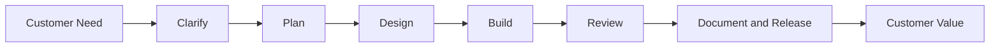

---

# 🎯 2. Executive Summary

Creolytix has adopted a governed AI-assisted software delivery model to improve how requirements are understood, transformed into engineering work, implemented, reviewed, documented, and communicated. Rather than treating AI as a standalone productivity layer, we use it as an integrated operating framework across the delivery lifecycle.

The model combines ChatGPT, Codex, GitHub Copilot, Google Stitch, Greptile, MCP servers, GitHub Boards, workspace-level plugin registration, and repository-local Codex controls. Each plays a distinct role. ChatGPT and Codex improve requirement clarity. Codex supports structured planning and issue decomposition. Google Stitch accelerates early UI direction. GitHub Boards supports execution visibility. GitHub Copilot supports implementation. Greptile improves PR review. MCP improves access to current, trusted technical context. Codex also helps with documentation and release note preparation.

This model is built on a clear principle: **AI must be useful, but it must also be governed**. Without shared operating controls, AI adoption can quickly create inconsistency, review friction, architectural drift, and localized quality gaps. Creolytix avoids this by standardizing AI usage at the workspace and repository level and by grounding implementation guidance in repository-native controls.

> **Executive takeaway:** The result is a more predictable path from customer request to delivered value. This improves both throughput and control.

The diagram below shows the operating outcomes this model is intended to improve.

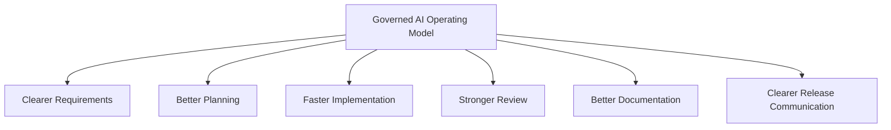

---

# ⏱️ 3. Why This Matters Now

Software organizations are under pressure to deliver faster while maintaining quality, security, and customer trust. At the same time, AI tooling has become increasingly accessible across product, design, and engineering workflows. That combination creates both opportunity and risk.

### 📌 Why now

- AI can improve speed, clarity, and operational efficiency
- unmanaged adoption can create inconsistent prompting and coding patterns
- fragmented local practices become harder to unwind over time
- standardization is easier to establish before inconsistency becomes embedded

Creolytix is at a point where standardization matters more than experimentation alone. The right time to define a governed AI operating model is before fragmented local practices become deeply embedded. By establishing shared controls early, Creolytix can scale AI adoption with more consistency, lower risk, and stronger long-term maintainability.

> **Leadership takeaway:** The question is no longer whether AI will be used. The question is whether it will be used in a consistent, reviewable, and enterprise-appropriate way.

The diagram below shows why delivery pressure, AI availability, and governance needs converge into a standardized operating model.

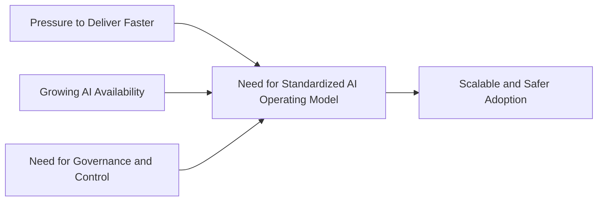

---

# ✅ 4. What Is Already Implemented Today

One of the most important ways to make this model credible is to distinguish between what is already real today and what remains part of the broader target state.

## ✅ Verified today

- the backend repository `Creolytix-GmbH/l3-net-creolytix-engr` contains a workspace marketplace configuration under `.agents/plugins/marketplace.json`
- that marketplace defines `creolytix-workspace`
- it registers the Engineering plugin `creolytix-codex`
- the plugin is marked `INSTALLED_BY_DEFAULT`
- the plugin metadata defines capabilities focused on `Code Quality` and `Standards`
- the plugin’s default prompt explicitly instructs Codex to use `$creolytix-backend-guardrails`
- the backend repository contains the real skill `creolytix-backend-guardrails`
- that skill includes reference material and a validation script
- the backend repository also contains `.github/ISSUE_TEMPLATE` and `.github/workflows`
- the frontend repository contains `.github/ISSUE_TEMPLATE`, `.github/PULL_REQUEST_TEMPLATE.md`, and `.github/workflows`

## 🎯 Why this matters

This means the document is not describing a purely theoretical future state. It is describing an operating model that already has verified implementation elements, especially in the backend repository.

The diagram below distinguishes current implemented controls from the broader direction of the operating model.

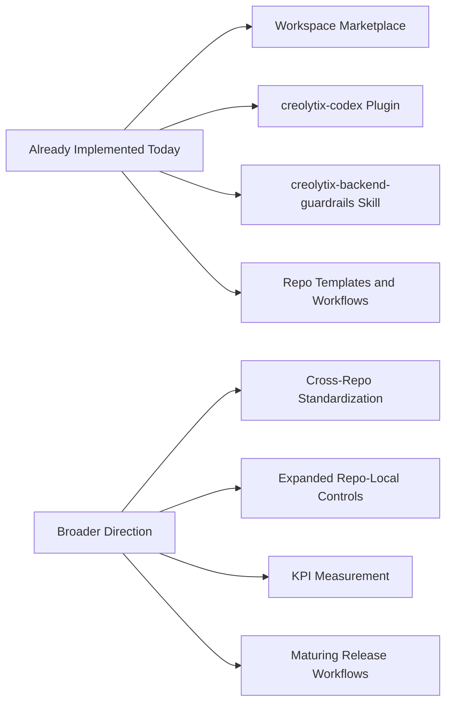

---

# 🧩 5. Problems This Model Solves

This model exists to solve operational problems across the software delivery lifecycle, not simply to showcase AI tools.

### 🔍 Core problems addressed

- ambiguous requirements
- planning friction
- weak design-to-engineering alignment
- inconsistent implementation and review quality
- documentation and communication lag
- ungoverned AI usage

Each of these creates avoidable delay, rework, inconsistency, or risk.

> **Practical effect:** The model is designed to reduce preventable friction before it becomes downstream engineering cost.

The diagram below shows the chain of delivery friction this model is designed to break.

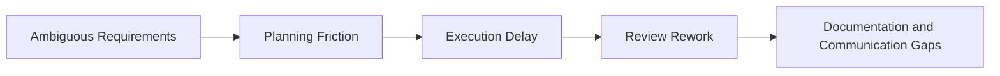

---

# 🎯 6. Objectives of the AI-Assisted Delivery Model

The objectives of the Creolytix AI-assisted delivery model go beyond productivity. The goal is not merely to help teams write code faster. The goal is to improve the speed, quality, consistency, control, and clarity of the full software delivery lifecycle.

The model is built around five objectives: speed, quality, consistency, guardrails, and human review. These objectives are interdependent. Speed without quality creates rework. Quality without consistency creates local variation. Guardrails without human review create false confidence. Human review without structured AI support can reduce leverage. The model is designed so these objectives reinforce one another.

## ⚡ 6.1 Speed
Creolytix uses AI to reduce the time required to move from customer input to execution-ready work. This includes faster clarification of requirements, faster issue and story planning, and faster preparation of documentation and release notes.

## 🏆 6.2 Quality
Creolytix uses AI to improve the quality of stories, acceptance criteria, issue decomposition, PR refinement, documentation, and release communication.

## 🔁 6.3 Consistency
Consistency is strengthened through centralized plugin registration, repo-local Codex rules, templates, workflows, and shared engineering principles.

## 🛡️ 6.4 Guardrails
Guardrails include security boundaries, approved workflows, constrained repository context, curated repo-local rules, and explicit approval checkpoints.

## 👥 6.5 Human Review
AI supports decision-making and delivery, but accountability remains with people.

> **Balanced-model takeaway:** The objective is not speed alone. The objective is governed leverage.

The diagram below provides a compact summary of these objectives.

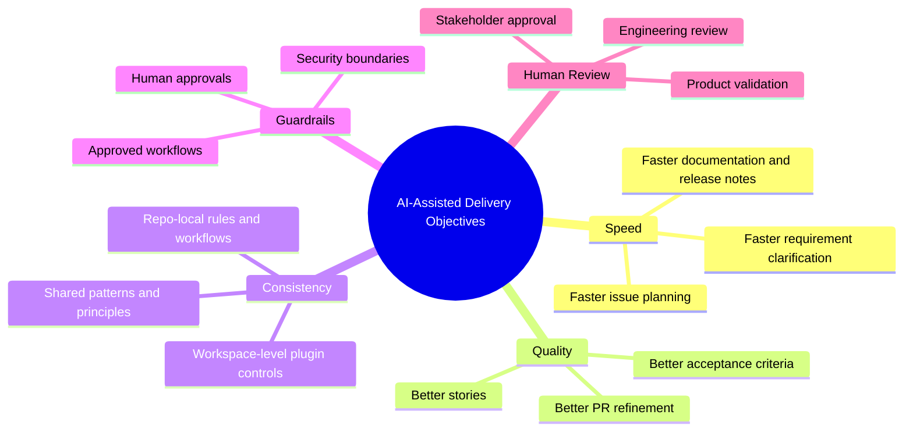

---

# 🏗️ 7. Executive Operating Model

At a high level, the model can be understood as a six-stage operating framework:

1. **Understand the need**  
2. **Translate it into structured work**  
3. **Align design and implementation**  
4. **Build inside shared guardrails**  
5. **Review and refine**  
6. **Communicate what changed**

> **Reader cue:** This shows that AI is embedded across the lifecycle, not isolated to coding.

The diagram below shows the six-stage executive operating model.

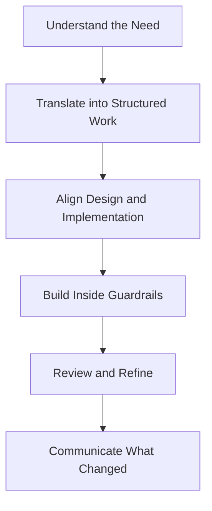

---

# 🛠️ 8. Tooling by Business Function

Each tool in the model supports a specific business function.

### 💬 ChatGPT and Codex for Requirement Understanding
Used to summarize customer discussions, clarify ambiguity, identify assumptions, and create structured problem statements.

### 🧱 Codex for Planning and Decomposition
Used to generate epics, stories, acceptance criteria, issue decomposition, documentation drafts, PR refinements, and release notes.

### 🎨 Google Stitch for UI Direction
Used to generate early UI concepts and improve design alignment before implementation begins.

### 📋 GitHub Boards for Planning Visibility
Used as the operational system where work becomes prioritized, assigned, sequenced, and tracked.

### 💻 GitHub Copilot for Implementation Support
Used to accelerate routine implementation work once scope and design are already clear.

### 🔎 Greptile for Repository-Aware Review
Used to review pull requests in repository context, especially where frontend, backend, and shared contracts intersect.

### 📚 MCP for Trusted Technical Context
Used to connect AI assistance to authoritative, current technical sources.

### 🔐 Workspace Plugins and Repo-Local Controls for Governance
Used to standardize AI behavior, encode repository-specific rules, and reduce inconsistent adoption.

The diagram below maps business functions to the tools that support them.

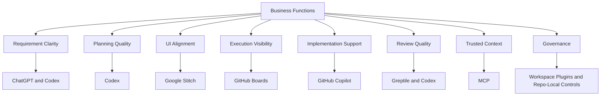

---

# 🔐 9. Codex in Practice in the Backend Repository

A major strength of the Creolytix model is that governance is not only described at a policy level. It is also implemented through real repository-native mechanisms in `Creolytix-GmbH/l3-net-creolytix-engr`.

## ✅ Verified backend Codex governance

- workspace: `creolytix-workspace`
- plugin: `creolytix-codex`
- default install policy: installed by default
- plugin capability focus: `Code Quality` and `Standards`
- default prompt instruction: use `$creolytix-backend-guardrails`
- repo-local skill: `creolytix-backend-guardrails`

> **Practical effect:** AI assistance is guided through a repo-level control layer before backend implementation begins.

The diagram below shows how a centrally registered plugin translates into governed repository behavior.

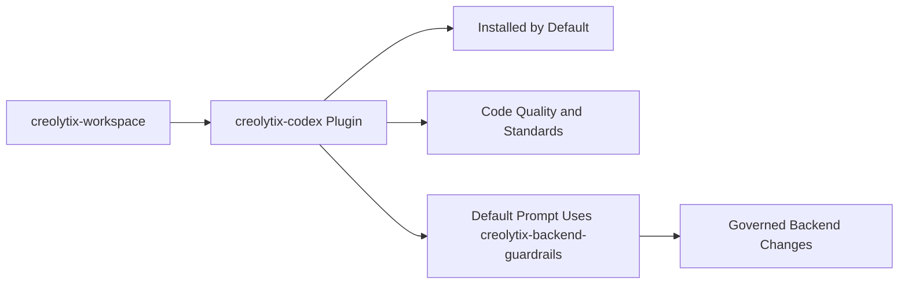

### 📁 Verified plugin and skill assets in the backend repo

- Workspace marketplace: `/.agents/plugins/marketplace.json`
- Plugin metadata: `/plugins/creolytix-codex/.codex-plugin/plugin.json`
- Skill: `/plugins/creolytix-codex/skills/creolytix-backend-guardrails/SKILL.md`
- Skill references: `/plugins/creolytix-codex/skills/creolytix-backend-guardrails/references/authoritative-files.md`
- Skill validation script: `/plugins/creolytix-codex/skills/creolytix-backend-guardrails/scripts/check-creolytix-backend-guardrails.ps1`

---

# ⚙️ 10. How the Verified Backend Skill Is Used in Practice

The existing skill `creolytix-backend-guardrails` provides a practical example of how Creolytix uses Codex for governed coding quality rather than generic assistance.

## 🧭 Quick-start behavior
The skill instructs the assistant to:

1. confirm that it is working in the correct backend repository  
2. read the nearest existing vertical slice before writing code  
3. consult authoritative repository reference files when placement, naming, indexing, or validation is unclear  
4. apply the rules before editing, while editing, and again before finalizing  
5. run the backend guardrail check script or perform equivalent validation manually  

## 🛡️ Practical coding-quality controls enforced by the skill

### Architecture and placement
- respect module, layer, and folder structure
- conform to `Creolytix.ArchitectureTests`
- keep `Program.cs` and host projects as composition roots only
- avoid bypassing DI patterns

### Naming and DI scanning conventions
- `*Service`
- `*Provider`
- `*Repository`
- `*Helper`
- `*Client`
- `*Handler`
- `*Validator`

### Documentation quality
- standard Creolytix file headers
- XML documentation for public members
- stale documentation must be fixed in touched files

### MongoDB quality controls
- review indexing needs when entities are introduced
- register indexes in `DbInitializer`
- use existing index patterns
- keep provider-translatable filter logic

### Finishing checks
- restore .NET tools if needed
- run `CSharpier`
- verify documentation and comments
- verify naming and discovery conventions
- verify MongoDB index registration
- run the backend guardrail validation script where appropriate

> **Leadership takeaway:** This is a concrete example of governed reuse. One repo-local skill can repeatedly improve backend change quality across many tasks and engineers.

The diagram below summarizes how the backend skill turns a backend coding task into a governed implementation workflow.

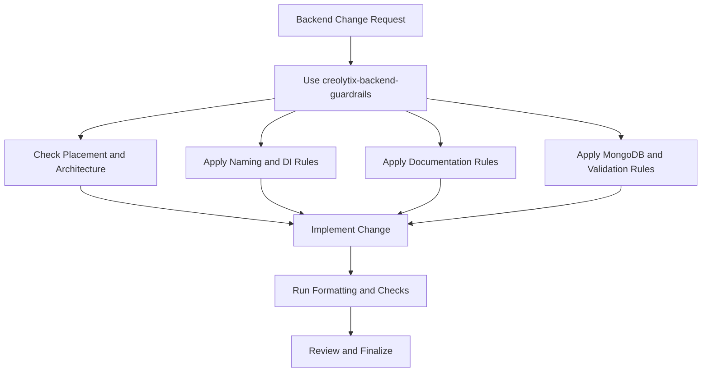

---

# 🔄 11. Before vs After Governed Backend AI Usage

One of the clearest ways to understand the value of governed AI usage is to compare a backend change before and after repository-local guardrails are applied.

## Before governed backend AI usage
- backend changes may be generated without awareness of module ownership or layer placement
- naming may drift away from DI scanning conventions
- MongoDB-backed entities may be introduced without matching index registration
- documentation and XML comments may be skipped or left stale
- formatting and architecture validation may happen late or inconsistently
- human review must spend more time catching preventable defects

## After governed backend AI usage
- Codex is directed to use `creolytix-backend-guardrails` before backend changes
- implementation begins with repo-local architecture, placement, and naming expectations
- MongoDB indexing is treated as part of the change
- documentation, XML comments, and formatting are part of the expected workflow
- validation and architecture checks happen earlier
- human review can focus more on correctness, business intent, and higher-value concerns

The diagram below contrasts unguided backend AI use with repo-governed backend AI use.

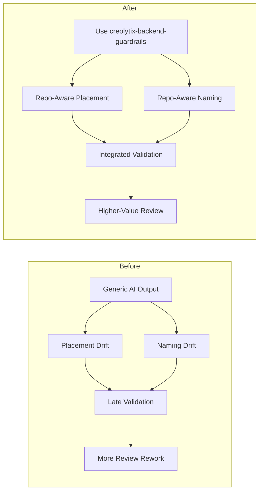

---

# 📦 12. Requirement-to-Release Example

A practical example helps make the model concrete.

Imagine a customer asks for an improvement to a reporting workflow. The request comes in through a customer conversation and follow-up notes. ChatGPT and Codex are used to clarify the actual need, identify ambiguities, and turn the request into a structured requirement.

Codex then creates an epic and several user stories. Because the reporting feature has a user-facing workflow, Google Stitch is used to create early UI concepts. Once the team agrees on direction, Codex helps decompose the work into UI/UX, frontend, and backend issues. GitHub Boards is used to prioritize and sequence the work.

Engineering then implements the solution. In the backend repository, governed Codex usage can begin by applying `creolytix-backend-guardrails` through the `creolytix-codex` plugin. GitHub Copilot accelerates routine coding. Repo-native workflows and human review complete the quality loop. A pull request is opened. Greptile reviews it in repository context. Codex helps interpret the findings and propose refinements. Human reviewers then approve the final changes.

After merge, Codex helps update repository documentation and draft release notes. Those notes are reviewed and then adapted for publication in Intercom so customers understand what changed and why it matters.

The diagrams below show this end-to-end example as both a flow and a cross-functional sequence.

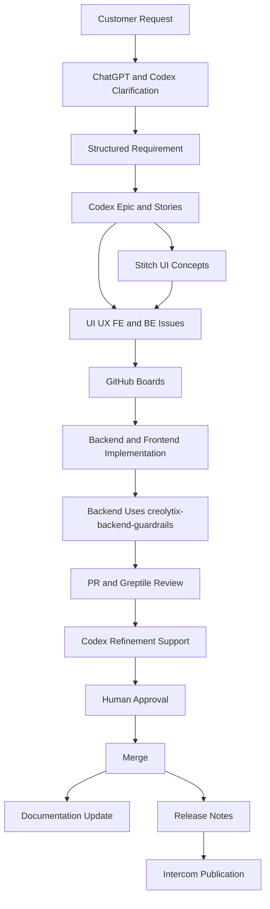

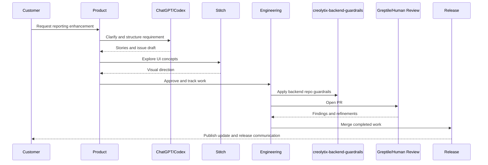

---

# 🌐 13. Full-Stack Repository Strategy

Creolytix operates across repositories with different technical profiles. That makes repository-aware AI support essential.

## Backend repository
`Creolytix-GmbH/l3-net-creolytix-engr` is overwhelmingly C#. This makes MCP-backed access to trusted .NET guidance, backend architectural consistency, and backend-specific Codex rules especially important.

## Frontend repository
`Creolytix-GmbH/l3-react-creolytix-engr` is primarily TypeScript and SCSS. This makes frontend decomposition, UI alignment, component consistency, and frontend-specific review context especially important.

### ✅ Frontend governance foundation already visible
- issue templates
- pull request template
- GitHub workflows

> **Balanced view:** The backend currently provides the strongest verified Codex governance example. The frontend already shows governance foundations through repo-native review and workflow assets.

The diagrams below show the repository strategy and the language composition of the primary repositories.

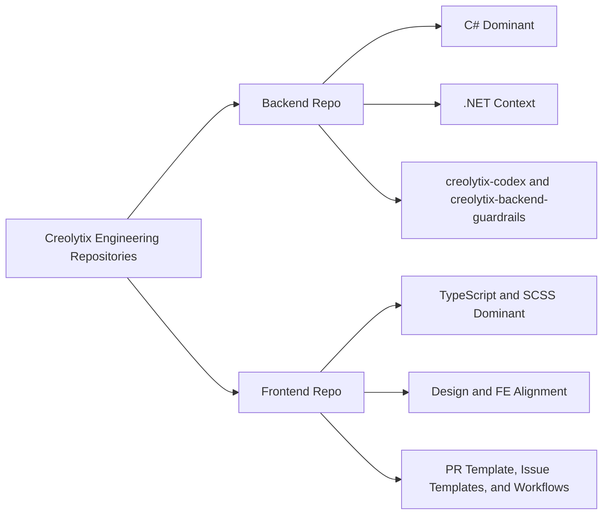

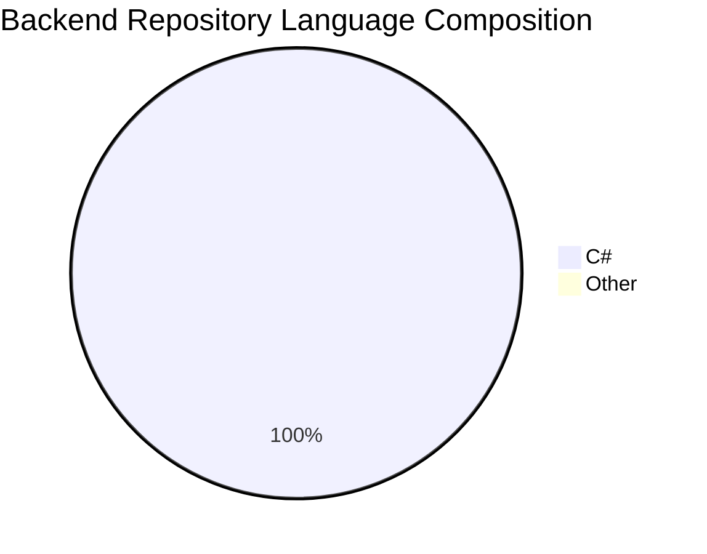

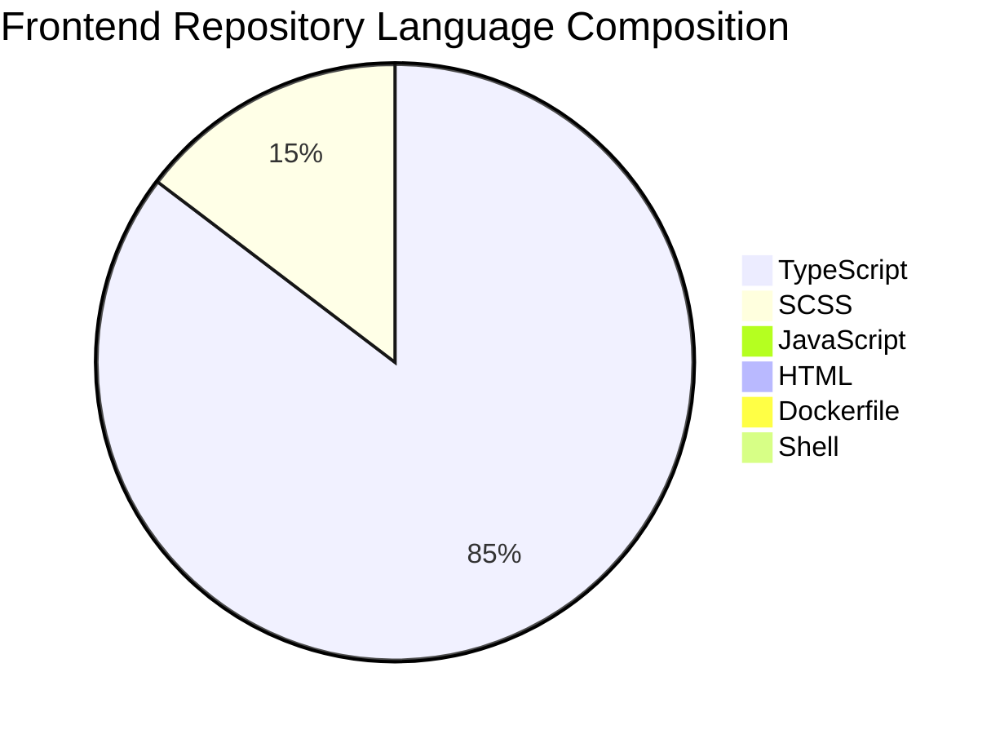

---

# 📍 14. Current State vs Next Step

A strong operating model should be clear about both present maturity and next priorities.

| Area | Current State | Next Step |
|---|---|---|
| Backend Codex governance | `creolytix-codex` plugin and `creolytix-backend-guardrails` skill verified in `l3-net-creolytix-engr` | Expand similar repo-local controls to additional backend domains and workflows |
| Workspace governance | `creolytix-workspace` marketplace structure exists in backend repo | Standardize workspace-level rollout patterns across more repositories |
| Backend quality enforcement | Repo-local skill governs architecture, naming, documentation, indexing, formatting, and validation | Extend measurement to prove impact on review quality and rework reduction |
| Frontend governance foundation | Issue templates, PR template, and workflows verified in `l3-react-creolytix-engr` | Add equivalent repo-local AI controls where appropriate |
| Cross-repo consistency | Shared operating model defined conceptually | Increase standardized AI controls across frontend and backend repos |
| KPI model | Success metrics identified | Begin active reporting and scorecard-based review |
| Release communication | AI-assisted release flow defined | Standardize measurable release-note and publication workflow |

> **Next-step takeaway:** The most immediate opportunity is to move from verified backend maturity to broader cross-repository governed adoption.

---

# 👥 15. Governance and Human Accountability

Governance is the most important control layer in the Creolytix model. AI adoption becomes risky when it becomes individualized, inconsistent, and weakly reviewed.

## 🔐 Governance layers
- workspace-level plugin registration
- repo-local Codex plugins and skills
- issue templates and workflows
- pull request templates where available
- human review and approval checkpoints

## 👤 Human accountability
- Product owns requirement intent and business validation
- Architecture owns structural and design decisions
- Engineering owns implementation correctness
- Reviewers own approval for merge
- Stakeholders own release communication approval

> **Core principle:** AI can draft, propose, summarize, and assist. It does not own final decision-making.

The diagrams below show the internal governance model and the human accountability model.

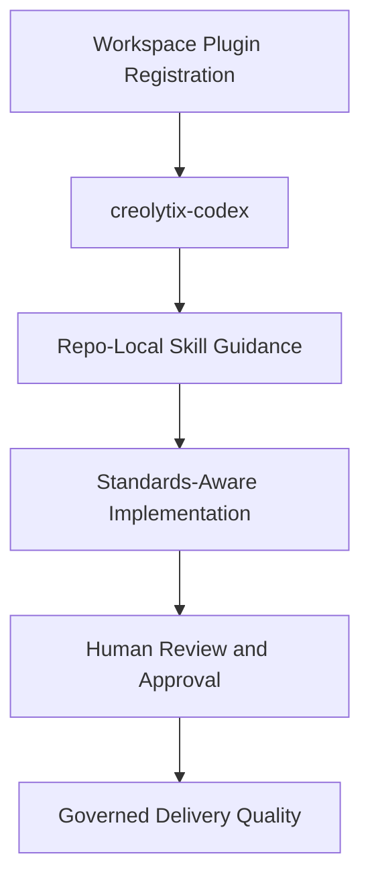

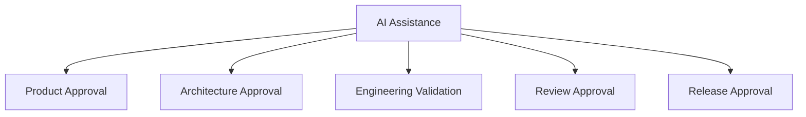

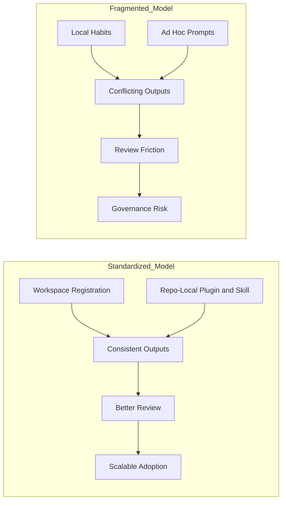

---

# 🛡️ 16. What This Model Prevents

The value of governed AI adoption is not only in what it enables, but also in what it helps prevent.

### 🚫 Failure modes this model helps avoid
- architecture drift across backend layers and modules
- inconsistent naming that breaks scanning and discovery conventions
- missing MongoDB index registration for persisted entities
- weak documentation hygiene and stale XML comments
- formatting and validation being deferred too late
- fragmented prompting practices across engineers
- repository-blind AI-generated code that does not fit the codebase
- low-value review cycles focused on preventable defects
- inconsistent release-note and documentation follow-through

The diagram below summarizes the main failure modes this model is designed to prevent.

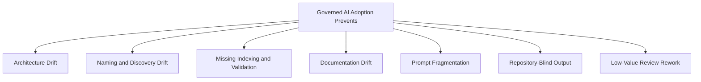

---

# 📝 17. Review, Documentation, and Release Communication

A major strength of this model is that it does not stop at implementation. Creolytix uses AI to improve how work is reviewed, documented, and communicated after the code is written.

### 🔄 Continuity after coding
- Greptile and Codex improve pull request refinement
- Codex helps keep repository documentation current
- Codex helps draft release notes from merged work
- release notes are reviewed and adapted for Intercom publication

> **Why this matters:** Delivery is not complete until work is reviewed, documented, and communicated clearly.

The diagram below shows how implementation flows into review, documentation, and release communication.

```mermaid
flowchart LR
    A[Implementation] --> B[PR Review]
    B --> C[PR Refinement]
    C --> D[Merge]
    D --> E[Documentation Update]
    D --> F[Release Notes]
    F --> G[Intercom Publication]
```

---

# ⚠️ 18. Risks Reduced by the Model

This model helps reduce multiple categories of enterprise risk.

### 📉 Risk categories reduced
- ambiguity in customer requirements
- inconsistent planning quality
- weak product to engineering handoffs
- fragmented design-to-engineering alignment
- inconsistent coding practices
- stale technical guidance
- incomplete review context
- documentation drift
- weak release communication
- ungoverned AI sprawl

> **Leadership takeaway:** This is not only a speed model. It is a risk-reduction model as well.

The diagram below groups the main risk areas this model is designed to reduce.

```mermaid
flowchart TB
    A[Enterprise Risks Reduced] --> B[Ambiguous Requirements]
    A --> C[Weak Planning Handoffs]
    A --> D[Design Misalignment]
    A --> E[Inconsistent Code Patterns]
    A --> F[Stale Technical Guidance]
    A --> G[Weak PR Review Context]
    A --> H[Documentation Drift]
    A --> I[Release Communication Gaps]
    A --> J[Ungoverned AI Adoption]
```

---

# 📊 19. Executive Scorecard for Success

For this model to be operationally credible, it should be measured.

| Dimension | Example Measure | Why It Matters |
|---|---|---|
| Speed | Time from requirement intake to issue readiness | Measures planning acceleration |
| Speed | Time from story approval to implementation start | Measures workflow readiness |
| Quality | PR revision cycles before approval | Measures quality before merge |
| Quality | Rework caused by misunderstood requirements | Measures upstream clarity |
| Consistency and Governance | Adoption of approved workspace plugins and repo-local controls | Measures standardized AI usage |
| Consistency and Governance | Percentage of AI-assisted changes passing defined review checkpoints | Measures governance compliance |
| Documentation | Time from merge to documentation update | Measures documentation discipline |
| Communication | Time from merge to release-note draft | Measures downstream communication speed |
| Communication | Release communication approval cycle time | Measures customer-facing readiness |

> **Measurement takeaway:** This model should be measured, not only described.

The diagram below groups the KPI model into four measurement domains.

```mermaid
flowchart TB
    A[Executive Scorecard] --> B[Speed]
    A --> C[Quality]
    A --> D[Consistency and Governance]
    A --> E[Documentation and Communication]
```

---

# 📈 20. AI Delivery Maturity Model

This model should be understood as a maturity journey.

### Level 1: Ad Hoc Prompting
Individuals experiment with AI in isolated ways.

### Level 2: Repeatable Team Workflows
Teams begin to use repeatable prompts and lightweight processes.

### Level 3: Workspace Registration and Repo-Local Controls
AI usage becomes more structured, with common controls at the workspace level and repository-specific guidance encoded locally.

### Level 4: End-to-End Governed AI Delivery
AI is used across the lifecycle in a coordinated way, with measurable workflows, shared controls, and defined approval points.

### Level 5: Continuously Optimized AI Operating Model
The organization continuously improves plugins, repo-local rules, governance, tooling, metrics, and cross-repository operating consistency.

> **Maturity takeaway:** Creolytix is moving from isolated tool usage toward a mature operational capability.

The diagram below shows the maturity progression.

```mermaid
flowchart LR
    A[Level 1 Ad Hoc Prompting] --> B[Level 2 Repeatable Team Workflows]
    B --> C[Level 3 Workspace Registration and Repo-Local Controls]
    C --> D[Level 4 End-to-End Governed Delivery]
    D --> E[Level 5 Continuously Optimized Model]
```

---

# 🔭 21. Benefits, Limitations, and Next Phase

## ✅ Benefits
- improved speed
- improved quality
- improved consistency
- stronger governance
- stronger communication continuity

## ⚠️ Limitations
- AI still depends on good context
- review discipline remains essential
- human expertise remains necessary
- tools can still produce imperfect output

## 🎯 Next phase
- expand repository-aware controls across more repos
- improve cross-repository context
- increase trusted MCP integrations
- strengthen measurement and KPI tracking
- further standardize release workflows
- continue maturing the shared AI operating model

The diagram below summarizes value today, constraints to respect, and the next direction of travel.

```mermaid
flowchart LR
    A[Benefits] --> A1[Speed]
    A --> A2[Quality]
    A --> A3[Consistency]
    A --> A4[Communication]

    B[Limitations] --> B1[Needs Human Judgment]
    B --> B2[Needs Strong Context]
    B --> B3[Needs Governance Discipline]

    C[Next Phase] --> C1[More Repo-Aware Controls]
    C --> C2[More Trusted Context]
    C --> C3[Better Measurement]
    C --> C4[Stronger Cross-Repo Consistency]
```

---

# 🧭 22. Leadership Recommendation

Creolytix should treat governed AI-assisted delivery as a strategic operating capability, not as a collection of local tool experiments.

### Recommended leadership actions
- standardize AI usage through workspace-level plugin registration
- expand repo-local Codex controls aligned with real codebase needs
- preserve strong human accountability and approval ownership
- measure delivery outcomes rather than only tool usage
- treat governance as a scaling enabler rather than a constraint
- build AI into the full delivery lifecycle, including planning, review, documentation, and release communication

> **Final recommendation:** The goal is not simply faster code generation. The goal is a more reliable, scalable, and governed way to deliver software quality across planning, engineering, and customer communication.

The diagram below summarizes the executive outcome of the overall model.

```mermaid
flowchart TD
    A[Governed AI Delivery Capability] --> B[Faster Delivery]
    A --> C[Better Quality]
    A --> D[Greater Consistency]
    A --> E[Lower Risk]
    A --> F[Stronger Customer Communication]
```

---

# 🔎 23. Verified Repository References

The following repository assets provide concrete evidence of governed backend Codex adoption in `Creolytix-GmbH/l3-net-creolytix-engr`.

### Backend Codex governance assets
- Workspace marketplace configuration  
  `/.agents/plugins/marketplace.json`

- Repo-local Codex plugin metadata  
  `/plugins/creolytix-codex/.codex-plugin/plugin.json`

- Backend guardrail skill  
  `/plugins/creolytix-codex/skills/creolytix-backend-guardrails/SKILL.md`

- Skill reference files  
  `/plugins/creolytix-codex/skills/creolytix-backend-guardrails/references/authoritative-files.md`

- Skill validation script  
  `/plugins/creolytix-codex/skills/creolytix-backend-guardrails/scripts/check-creolytix-backend-guardrails.ps1`

### Additional verified governance assets
- Backend issue templates  
  `Creolytix-GmbH/l3-net-creolytix-engr/.github/ISSUE_TEMPLATE`

- Backend workflows  
  `Creolytix-GmbH/l3-net-creolytix-engr/.github/workflows`

- Frontend issue templates  
  `Creolytix-GmbH/l3-react-creolytix-engr/.github/ISSUE_TEMPLATE`

- Frontend pull request template  
  `Creolytix-GmbH/l3-react-creolytix-engr/.github/PULL_REQUEST_TEMPLATE.md`

- Frontend workflows  
  `Creolytix-GmbH/l3-react-creolytix-engr/.github/workflows`

> **Closing note:** These assets demonstrate that Creolytix already has real plugin, skill, template, and workflow-based mechanisms for guiding coding quality and governed AI adoption through repository-native controls.
