# Creolytix AI-Assisted Software Delivery Model
## Executive Leadership Summary and Operating Framework

## 1. One-Page Leadership Summary

Creolytix is building a governed AI-assisted software delivery capability that improves how customer needs are translated into high-quality software delivery. This model combines Codex, ChatGPT, GitHub Copilot, Google Stitch, Greptile, MCP servers, GitHub Boards, workspace-specific Codex plugins, and repository-local skills into a single operating framework.

The strategic value of this model is clear. It improves delivery speed, strengthens engineering quality, reduces ambiguity in planning, improves consistency across teams and repositories, and creates a more reliable path from customer request to customer communication. Rather than using AI only as a coding tool, Creolytix applies it across the full lifecycle, including requirement clarification, story planning, design exploration, implementation support, pull request refinement, documentation maintenance, release note preparation, and customer-facing communication.

The most important aspect of the model is governance. AI becomes risky when every team or individual uses different prompts, local agents, and inconsistent review standards. Creolytix addresses this through workspace-specific plugins and repository-local skills that help ensure shared guardrails, common engineering principles, consistent design patterns, and more predictable delivery quality.

From a leadership perspective, the model creates value in five ways:

- **Faster delivery flow**  
  It reduces the time required to move from customer input to execution-ready work.

- **Higher quality output**  
  It improves requirement clarity, issue quality, PR refinement, documentation quality, and release communication.

- **Greater consistency**  
  It reduces fragmented AI usage and helps teams work within shared standards.

- **Safer AI adoption**  
  It introduces governance, approval checkpoints, and repository-aware controls.

- **Better customer communication**  
  It improves the quality and consistency of documentation and release note publication.

This is not a temporary tool experiment. It is a structured delivery capability. AI assists people across the lifecycle, but accountability remains with product, architecture, engineering, reviewers, and release stakeholders.

The diagram below summarizes the leadership-level value chain from customer need to customer value.

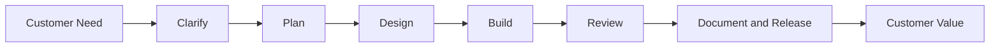

---

## 2. Executive Summary

Creolytix has adopted a governed AI-assisted software delivery model to improve how requirements are understood, transformed into engineering work, implemented, reviewed, documented, and communicated. Rather than treating AI as a standalone productivity layer, we use it as an integrated operating framework across the delivery lifecycle.

The model combines ChatGPT, Codex, GitHub Copilot, Google Stitch, Greptile, MCP servers, GitHub Boards, workspace-specific Codex plugins, and repository-local skills. Each plays a distinct role. ChatGPT and Codex improve requirement clarity. Codex supports structured planning and issue decomposition. Google Stitch accelerates early UI direction. GitHub Boards supports execution visibility. GitHub Copilot supports implementation. Greptile improves PR review. MCP improves access to current, trusted technical context. Codex also helps with documentation and release note preparation.

This model is built on a clear principle: AI must be useful, but it must also be governed. Without shared operating controls, AI adoption can quickly create inconsistency, review friction, architectural drift, and localized skill chaos. Creolytix avoids this by standardizing AI usage at the workspace and repository level.

The result is a more predictable path from customer request to delivered value. This improves both throughput and control. It reduces ambiguity earlier, improves quality during execution, and strengthens downstream communication after release.

The diagram below shows the operating outcomes this model is intended to improve.

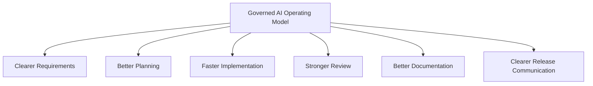

---

## 3. Why This Matters Now

The timing for this model matters. Software organizations are under pressure to deliver faster while maintaining quality, security, and customer trust. At the same time, AI tooling has become increasingly accessible across product, design, and engineering workflows. That combination creates both opportunity and risk.

The opportunity is clear. AI can improve speed, clarity, and operational efficiency across multiple stages of delivery. The risk is equally clear. If adoption happens in an unstructured way, teams can drift into inconsistent prompting habits, inconsistent coding practices, uneven governance, and fragmented review standards.

Creolytix is at a point where standardization matters more than experimentation alone. The right time to define a governed AI operating model is before fragmented local practices become deeply embedded. By establishing shared controls early, Creolytix can scale AI adoption with more consistency, lower risk, and stronger long-term maintainability.

This is important not only from an engineering perspective, but also from a leadership perspective. The question is no longer whether AI will be used. The question is whether it will be used in a consistent, reviewable, and enterprise-appropriate way.

The diagram below shows why delivery pressure, AI availability, and governance needs converge into a standardized operating model.

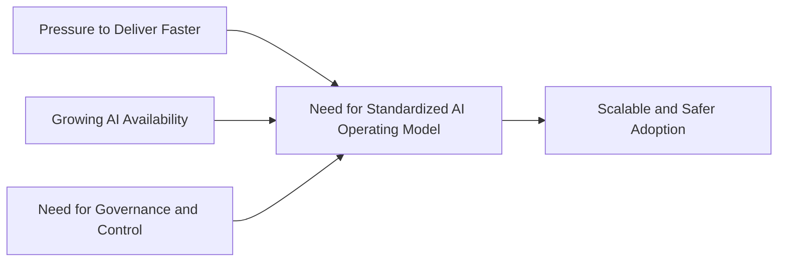

---

## 4. Problems This Model Solves

This model exists to solve operational problems across the software delivery lifecycle, not simply to showcase AI tools.

The first problem is requirement ambiguity. Customer requests are often incomplete, spread across multiple conversations, or framed in business language rather than delivery language. This creates delays and confusion later.

The second problem is planning friction. Teams often spend too much time converting rough ideas into implementation-ready stories and issues. That slows execution and creates inconsistent issue quality.

The third problem is weak design-to-engineering alignment. UI and workflow expectations can remain unclear until too late, leading to churn between product, design, frontend, and backend teams.

The fourth problem is inconsistent implementation and review quality. Different engineers or teams may use different prompting styles, different local coding agents, or different review assumptions. This creates inconsistency, review friction, and architectural drift.

The fifth problem is documentation and communication lag. Even when implementation succeeds, documentation updates and release note preparation often happen too late or inconsistently.

The sixth problem is ungoverned AI usage. Without a standardized model, local experimentation can produce a fragmented environment of disconnected skills, inconsistent practices, and unclear approval boundaries.

The diagram below shows the chain of delivery friction this model is designed to break.

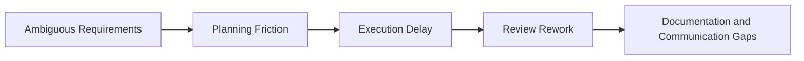

---

## 5. Objectives of the AI-Assisted Delivery Model

The objectives of the Creolytix AI-assisted delivery model go beyond productivity. The goal is not merely to help teams write code faster. The goal is to improve the speed, quality, consistency, control, and clarity of the full software delivery lifecycle.

The model is built around five objectives: speed, quality, consistency, guardrails, and human review. These objectives are interdependent. Speed without quality creates rework. Quality without consistency creates local variation. Guardrails without human review create false confidence. Human review without structured AI support can reduce leverage. The model is designed so these objectives reinforce one another.

### 5.1 Speed

Creolytix uses AI to reduce the time required to move from customer input to execution-ready work. This includes faster clarification of requirements, faster issue and story planning, and faster preparation of documentation and release notes.

Speed also applies during implementation. GitHub Copilot helps engineers move faster during coding. Codex accelerates planning, drafting, and communication work. The objective is not speed at any cost. The objective is reducing unnecessary delay across the workflow.

### 5.2 Quality

Creolytix uses AI to improve the quality of stories, acceptance criteria, issue decomposition, PR refinement, documentation, and release communication. Better planning quality creates better engineering outcomes. Better review quality creates better merge quality. Better communication quality creates better customer understanding.

Quality in this model includes more than code quality. It includes planning quality, design alignment quality, review quality, documentation quality, and communication quality.

### 5.3 Consistency

Consistency is one of the most important strategic objectives. Creolytix does not want different teams or developers using AI in incompatible ways. That would create inconsistent prompting styles, inconsistent implementation patterns, inconsistent review expectations, and fragmented standards.

Consistency is strengthened through workspace-specific plugins, repository-local skills, and shared engineering principles. This reduces drift and improves maintainability.

### 5.4 Guardrails

AI requires boundaries. Guardrails include security boundaries, approved workflows, constrained repository context, curated skills, and explicit approval checkpoints. These guardrails help keep AI outputs aligned with enterprise expectations and repository standards.

The purpose of guardrails is not to slow teams down. It is to make AI usage safer, more predictable, and more scalable.

### 5.5 Human Review

AI supports decision-making and delivery, but accountability remains with people. Product leaders validate requirements. Architects validate design decisions. Engineers validate implementation. Reviewers validate PRs. Stakeholders validate release communication.

This is a human-in-the-loop model by design. AI assists. Humans decide.

The diagram below provides a compact summary of these objectives.

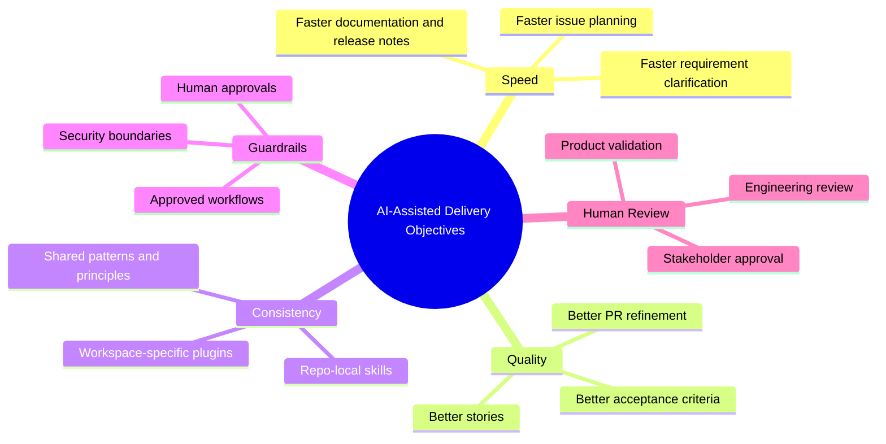

---

## 6. Executive Operating Model

At a high level, the model can be understood as a six-stage operating framework:

1. Understand the need  
2. Translate it into structured work  
3. Align design and implementation  
4. Build inside shared guardrails  
5. Review and refine  
6. Communicate what changed  

This framing is useful because it shows that AI is not concentrated in one activity. Different tools support different stages, but all within one integrated model.

The diagram below shows the six-stage executive operating model.

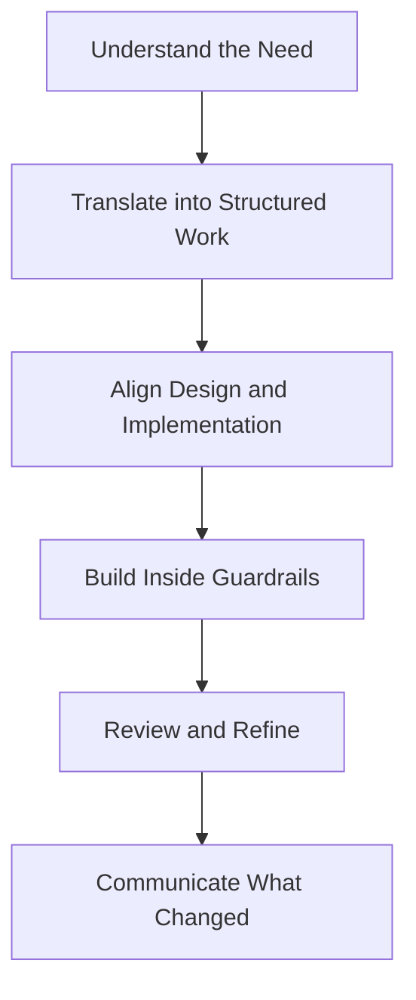

---

## 7. Tooling by Business Function

Each tool in the model supports a specific business function.

### ChatGPT and Codex for Requirement Understanding
Used to summarize customer discussions, clarify ambiguity, identify assumptions, and create structured problem statements.

### Codex for Planning and Decomposition
Used to generate epics, stories, acceptance criteria, issue decomposition, documentation drafts, PR refinements, and release notes.

### Google Stitch for UI Direction
Used to generate early UI concepts and improve design alignment before implementation begins.

### GitHub Boards for Planning Visibility
Used as the operational system where work becomes prioritized, assigned, sequenced, and tracked.

### GitHub Copilot for Implementation Support
Used to accelerate routine implementation work once scope and design are already clear.

### Greptile for Repository-Aware Review
Used to review pull requests in repository context, especially where frontend, backend, and shared contracts intersect.

### MCP for Trusted Technical Context
Used to connect AI assistance to authoritative, current technical sources, especially valuable for modern .NET and C# development.

### Workspace Plugins and Repo-Local Skills for Governance
Used to standardize AI behavior, encode local patterns, and reduce inconsistent adoption.

The diagram below maps business functions to the tools that support them.

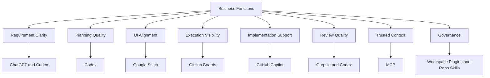

---

## 8. Governance and Human Accountability

Governance is the most important control layer in the Creolytix model. AI adoption becomes risky when it becomes individualized, inconsistent, and weakly reviewed. Without common controls, different developers can create different prompt patterns, inconsistent implementation habits, different review expectations, and conflicting local practices.

Creolytix avoids this by standardizing AI use at two levels:

- **Workspace-specific plugins**, which define shared operating boundaries and common expectations
- **Repo-local skills**, which encode repository-specific architecture, patterns, naming standards, test expectations, and review norms

Together, these create more predictable, more reviewable, and more scalable AI adoption.

### Human Accountability

Human accountability is explicit in this model.

- Product owns requirement intent and business validation
- Architecture owns structural and design decisions
- Engineering owns implementation correctness
- Reviewers own approval for merge
- Stakeholders own release communication approval

AI can draft, propose, summarize, and assist. It does not own final decision-making.

The diagrams below show the internal governance model and the human accountability model.

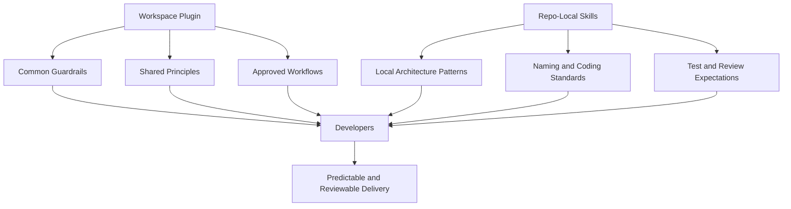

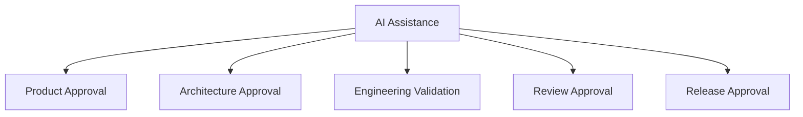

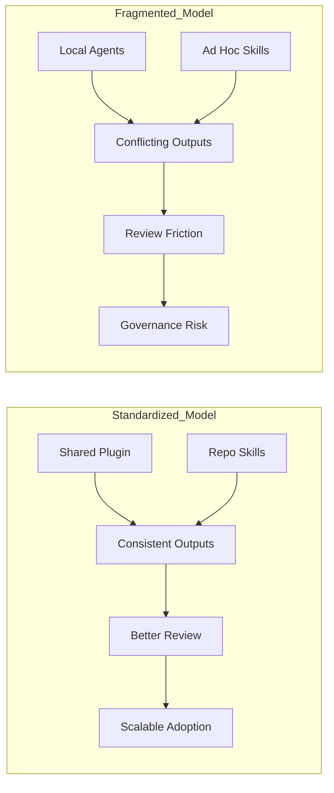

---

## 9. Requirement-to-Release Example

A practical example helps make the model concrete.

Imagine a customer asks for an improvement to a reporting workflow. The request comes in through a customer conversation and follow-up notes. ChatGPT and Codex are used to clarify the actual need, identify ambiguities, and turn the request into a structured requirement.

Codex then creates an epic and several user stories. Because the reporting feature has a user-facing workflow, Google Stitch is used to create early UI concepts. Once the team agrees on direction, Codex helps decompose the work into UI/UX, frontend, and backend issues. GitHub Boards is used to prioritize and sequence the work.

Engineering then implements the solution. GitHub Copilot accelerates routine coding. Repo-local skills reinforce the expected repository patterns. MCP provides trusted technical context where needed. A pull request is opened. Greptile reviews it in repository context. Codex helps interpret the findings and propose refinements. Human reviewers then approve the final changes.

After merge, Codex helps update repository documentation and draft release notes. Those notes are reviewed and then adapted for publication in Intercom so customers understand what changed and why it matters.

The diagrams below show this end-to-end example as both a flow and a cross-functional sequence.

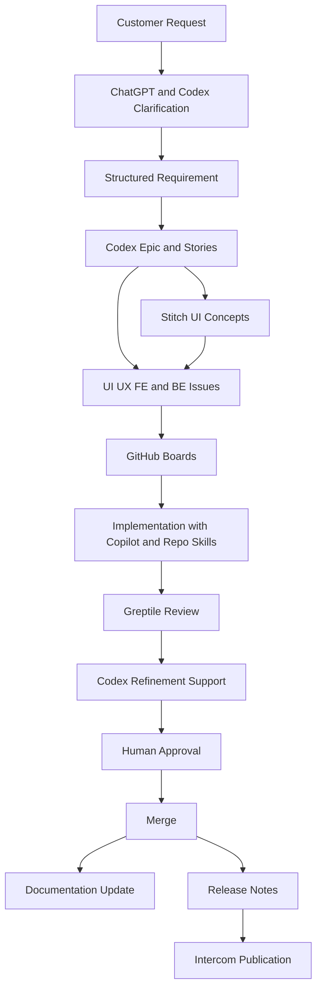

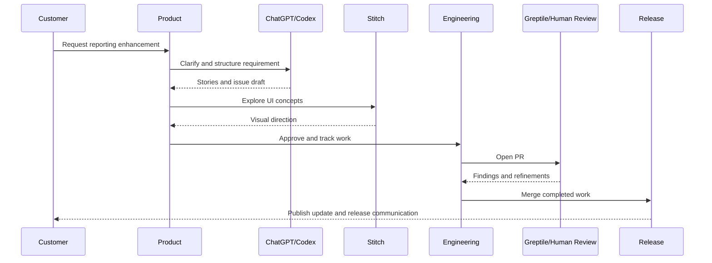

---

## 10. Full-Stack Repository Strategy

Creolytix operates across repositories with different technical profiles. That makes repository-aware AI support essential.

The backend repository `Creolytix-GmbH/l3-net-creolytix-engr` is overwhelmingly C#. This makes MCP-backed access to trusted .NET guidance, backend architectural consistency, and backend-specific repository skills especially important.

The frontend repository `Creolytix-GmbH/l3-react-creolytix-engr` is primarily TypeScript and SCSS. This makes frontend decomposition, UI alignment, component consistency, and frontend-specific review context especially important.

This full-stack reality is one reason governance matters. A shared operating model must still accommodate different technical layers. Repo-local skills and repository-aware review allow Creolytix to standardize AI usage without making it generic or disconnected from actual codebase needs.

The diagrams below show the repository strategy and the language composition of the primary repositories.

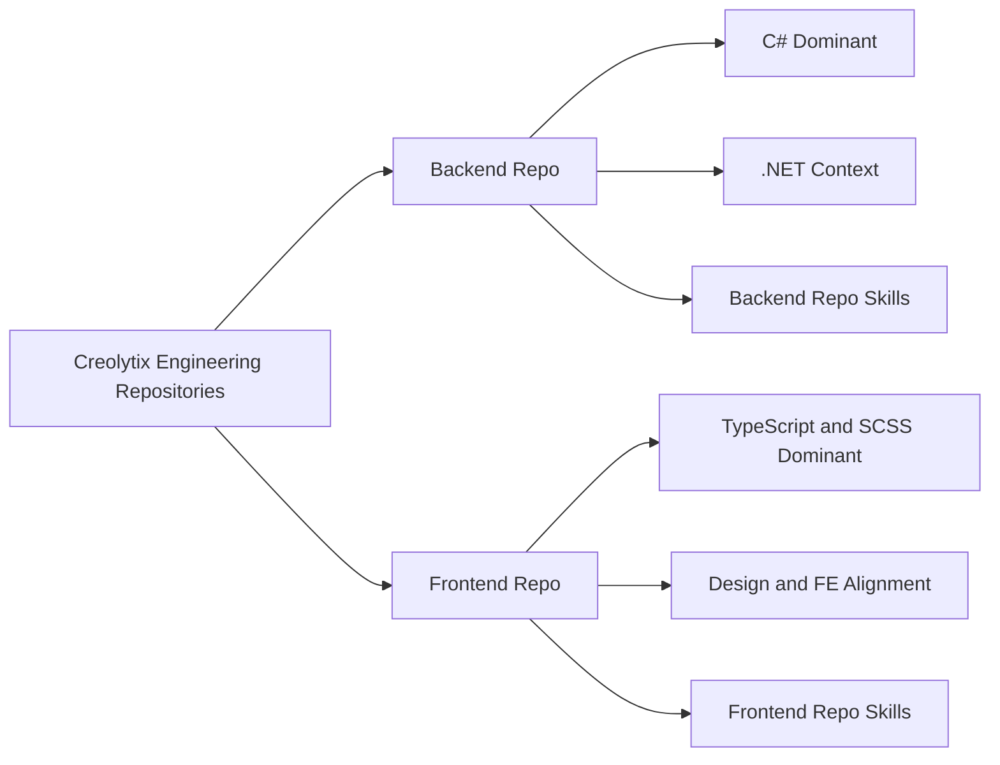

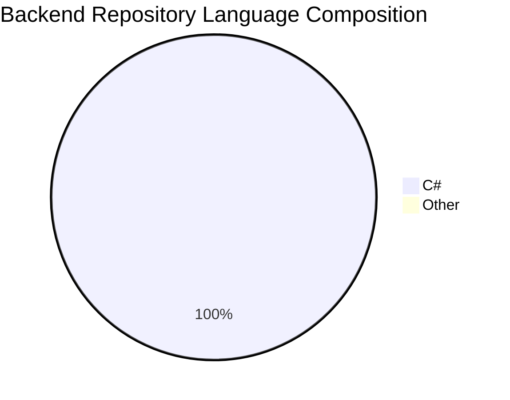

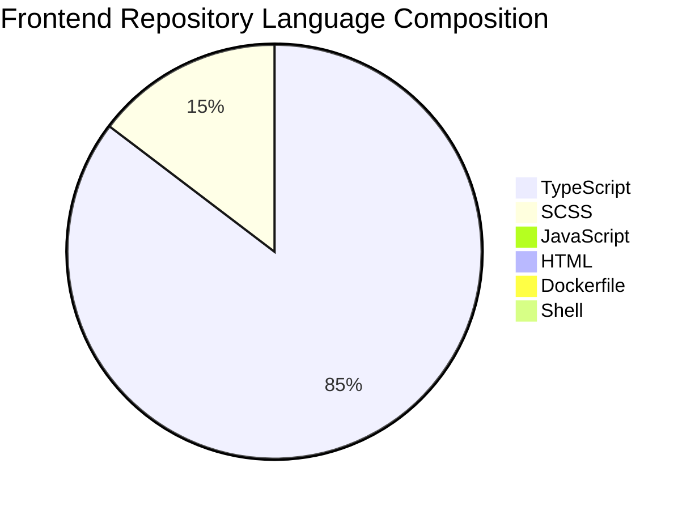

---

## 11. Review, Documentation, and Release Communication

A major strength of this model is that it does not stop at implementation. Creolytix uses AI to improve how work is reviewed, documented, and communicated after the code is written.

Greptile and Codex improve pull request refinement. Codex helps keep repository documentation current. Codex also helps draft release notes from merged work and related issue context. Those release notes are then reviewed and adapted for customer communication through Intercom.

This creates continuity between implementation, review, documentation, and release communication. It also reduces the common enterprise problem where code ships faster than documentation or customer communication can keep up.

The diagram below shows how implementation flows into review, documentation, and release communication.

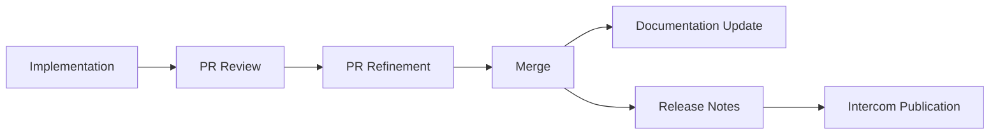

---

## 12. Risks Reduced by the Model

This model helps reduce multiple categories of enterprise risk.

- ambiguity in customer requirements
- inconsistent planning quality
- weak product to engineering handoffs
- fragmented design-to-engineering alignment
- inconsistent coding practices
- stale technical guidance
- incomplete review context
- documentation drift
- weak release communication
- unmanaged AI sprawl

From a leadership standpoint, this is important because the model improves both throughput and control. It is not only a speed model. It is a risk-reduction model as well.

The diagram below groups the main risk areas this model is designed to reduce.

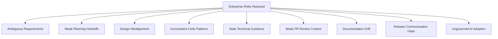

---

## 13. Success Measures and KPIs

For this model to be operationally credible, it should be measured. The purpose of measurement is not only to track usage, but to confirm whether the model is improving delivery outcomes.

### Speed Measures
- time from requirement intake to issue readiness
- time from story approval to implementation start
- documentation update turnaround after merge
- release note preparation turnaround

### Quality Measures
- number of clarification cycles per feature
- rework caused by misunderstood requirements
- PR revision cycles before approval
- review findings resolved before merge

### Consistency and Governance Measures
- adoption of approved workspace plugins
- usage of repo-local skills in targeted workflows
- consistency of implementation patterns across repositories
- percentage of AI-assisted outputs going through defined review checkpoints

### Communication Measures
- time from merge to customer-facing release note draft
- documentation freshness for major releases
- release communication approval cycle time

Even if all of these are not immediately measured, defining them is important. It clarifies what success should look like and makes the operating model more accountable.

The diagram below groups the KPI model into four measurement domains.

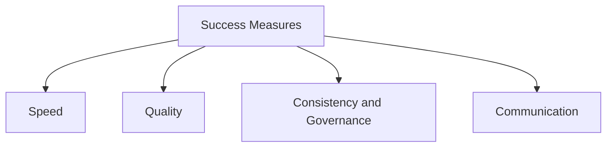

---

## 14. AI Delivery Maturity Model

This model should be understood as a maturity journey.

### Level 1: Ad Hoc Prompting
Individuals experiment with AI in isolated ways. Practices are inconsistent and governance is weak.

### Level 2: Repeatable Team Workflows
Teams begin to use repeatable prompts and lightweight processes, but adoption remains uneven.

### Level 3: Workspace-Standardized Plugins and Repo-Local Skills
AI usage becomes more structured, with common controls at the workspace level and repository-specific guidance encoded locally.

### Level 4: End-to-End Governed AI Delivery
AI is used across the lifecycle in a coordinated way, with measurable workflows, shared controls, and defined approval points.

### Level 5: Continuously Optimized AI Operating Model
The organization continuously improves skills, governance, tooling, metrics, and cross-repository operating consistency.

Creolytix is moving from isolated tool usage toward a mature operational capability. That maturity should be treated as a strategic advantage.

The diagram below shows the maturity progression.

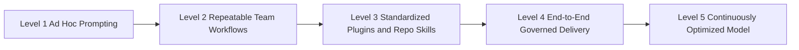

---

## 15. Benefits, Limitations, and Next Phase

### Benefits
This model improves speed, quality, consistency, governance, and communication across the delivery lifecycle. It creates a stronger path from customer request to shipped value.

### Limitations
AI still depends on good context, strong review discipline, and human expertise. Poor input can still create poor output. Review tools can still generate false positives. Governance discipline remains essential.

### Next Phase
The next phase is to deepen reuse and strengthen scale:
- expand curated skill libraries
- improve cross-repository context
- increase trusted MCP integrations
- strengthen measurement and KPI tracking
- further standardize release workflows
- continue maturing the shared AI operating model

The diagram below summarizes value today, constraints to respect, and the next direction of travel.

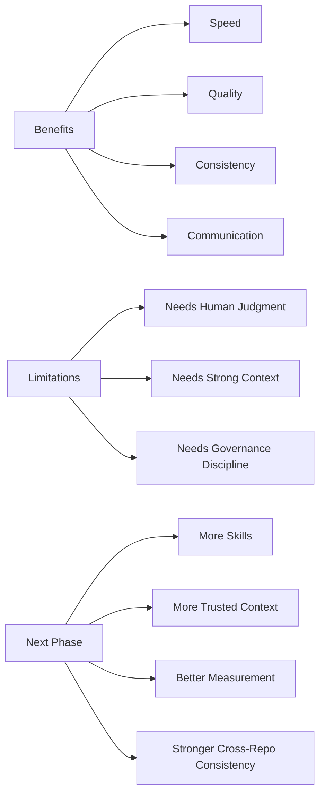

---

## 16. Leadership Recommendation

Creolytix should continue investing in AI-assisted delivery as a governed operating capability, not as a collection of local tool experiments.

That means continuing to:
- standardize AI usage through workspace plugins
- expand repo-local skills aligned with real codebase needs
- preserve strong human accountability and approval ownership
- measure delivery outcomes rather than only tool usage
- treat governance as a scaling enabler rather than a constraint
- build AI into the full delivery lifecycle, including planning, review, documentation, and release communication

The strategic objective should be clear: build a delivery capability that is faster, more consistent, more reviewable, and safer to scale.

The diagram below summarizes the executive outcome of the overall model.

```mermaid
flowchart TD
    A[Governed AI Delivery Capability] --> B[Faster Delivery]
    A --> C[Better Quality]
    A --> D[Greater Consistency]
    A --> E[Lower Risk]
    A --> F[Stronger Customer Communication]
```
