# Creolytix AI-Assisted Software Delivery Model  
## Executive Leadership Summary and Operating Overview

## 1. One-Page Leadership Summary

Creolytix uses AI as a governed delivery capability, not as an isolated productivity tool. Our model combines Codex, ChatGPT, GitHub Copilot, Google Stitch, Greptile, MCP servers, GitHub Boards, workspace-specific Codex plugins, and repository-local skills to improve how customer needs are converted into shipped software.

The core business value of this model is straightforward. It helps us move faster while improving consistency, reducing ambiguity, and strengthening engineering quality. Instead of using AI only for code generation, we apply it across the delivery lifecycle, from requirement clarification to planning, design acceleration, implementation, pull request review, documentation, release notes, and customer communication.

What makes this model strategically important is governance. AI creates risk when every developer, team, or workflow evolves independently. That leads to inconsistent patterns, variable quality, unclear review standards, and weak control over how generated output is produced. Creolytix addresses this by standardizing AI usage through workspace-specific plugins and repository-local skills so teams operate within a common framework of engineering principles, guardrails, and delivery expectations.

At a leadership level, this model delivers value in five areas:

- **Faster requirement-to-delivery flow**  
  Customer requests can be clarified, structured, and translated into execution-ready work more quickly.

- **Better delivery quality**  
  Better issue definition, better decomposition, stronger review support, and more aligned documentation improve the quality of execution.

- **Greater consistency across teams**  
  Shared plugins, repo-local skills, and common review patterns reduce fragmentation and drift.

- **Safer enterprise AI adoption**  
  Governance, human approval, and constrained skills reduce the risk of unmanaged coding-agent sprawl.

- **Stronger communication and operational clarity**  
  Documentation, release notes, and Intercom publication become part of the same controlled workflow rather than disconnected activities.

In practical terms, this means Creolytix is building an AI-enabled software delivery model that is scalable, repeatable, and easier to govern. AI is not replacing product, design, architecture, or engineering judgment. It is amplifying them inside a controlled operating model.

The diagram below summarizes the leadership-level value chain from customer need to customer value.

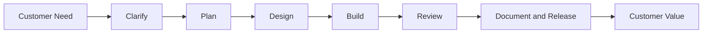

---

## 2. Executive Summary

Creolytix has adopted a governed AI-assisted software delivery model to improve how customer needs are understood, translated into engineering work, implemented, reviewed, documented, and communicated. Rather than treating AI as a standalone productivity layer, we use it as an integrated operating model across the delivery lifecycle.

Our model combines ChatGPT, Codex, GitHub Copilot, Google Stitch, Greptile, MCP servers, GitHub Boards, workspace-specific Codex plugins, and repository-local skills. Each tool plays a specific role. ChatGPT and Codex improve requirement clarity. Stitch accelerates UI exploration. Copilot supports implementation. Greptile improves PR review. MCP improves access to current authoritative technical context. Codex also supports documentation and release note generation.

The model is designed around one central principle: **AI must be productive, but it must also be governed**. Without common controls, AI adoption can create fragmented prompting habits, inconsistent engineering practices, and localized skill chaos. Creolytix avoids this by standardizing AI interactions at the workspace and repository level.

This gives us a more consistent path from customer request to delivered value. It reduces ambiguity earlier, strengthens execution later, and improves the quality of communication after release.

The diagram below shows the operating outcomes this model is designed to improve.

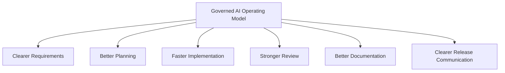

---

## 3. Why This Matters to Leadership

From a leadership perspective, the main value of this model is not just faster coding. It is stronger operational performance across the software delivery lifecycle.

In many organizations, delays and quality issues begin long before code is written. They start with unclear requirements, weak issue definition, poor design to engineering handoff, inconsistent implementation patterns, or fragmented review practices. AI can improve each of these, but only if it is used systematically.

Creolytix’s approach creates that system. It gives product, design, architecture, and engineering teams a shared operating model that makes delivery more predictable. It also improves how knowledge flows through the lifecycle, from requirement capture, to issue planning, to review, to release communication.

Leadership should view this model as a capability that improves throughput, quality, and control at the same time. That combination is what makes it strategically important.

The diagram below contrasts a fragmented delivery path with a governed delivery path.

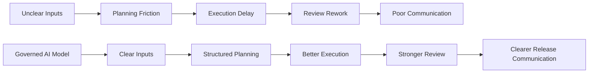

---

## 4. Objectives of the AI-Assisted Delivery Model

The objectives of the Creolytix AI-assisted delivery model go beyond productivity. The purpose is not simply to help teams write code faster. The purpose is to improve the quality, consistency, control, and clarity of the entire software delivery lifecycle.

At the highest level, the model has five objectives: speed, quality, consistency, guardrails, and human review. These objectives work together. Speed without quality creates rework. Quality without consistency creates local variation and operational friction. Guardrails without human review create a false sense of safety. Human review without structured AI support can slow delivery and reduce the leverage that AI can provide. The model is designed so these objectives reinforce one another.

### 4.1 Speed

The first objective is speed. Creolytix uses AI to reduce the time required to move from customer input to execution-ready work. This includes faster clarification of requirements, faster planning of issues and stories, and faster preparation of documentation and release notes.

This matters because many delivery delays happen before engineering starts writing code. If teams spend too much time translating unclear discussions into structured work, the entire delivery cycle slows down. By using ChatGPT and Codex to summarize, structure, and clarify, Creolytix shortens the path from idea to action.

Speed also applies later in the lifecycle. Copilot helps engineers move faster during implementation. Codex helps move faster during planning, documentation, and release note creation. The goal is not speed for its own sake. The goal is reducing avoidable delay across the workflow.

### 4.2 Quality

The second objective is quality. AI is used to improve the quality of stories, acceptance criteria, decomposition, pull request review, and downstream documentation. Better quality upstream leads to better execution downstream.

For example, if a user story is more complete, the engineering team has less ambiguity. If acceptance criteria are clearer, testing and validation become easier. If Greptile and Codex improve PR refinement, the resulting code quality improves before merge. If documentation and release notes are drafted more clearly, the customer-facing outcome improves as well.

In this model, quality is not limited to code. It includes planning quality, review quality, communication quality, and documentation quality.

### 4.3 Consistency

The third objective is consistency. This is one of the most important strategic goals in the model. Creolytix does not want every developer or team using AI in completely different ways. That would create inconsistent implementation patterns, inconsistent prompting styles, inconsistent review expectations, and fragmented standards.

Consistency is achieved through workspace-specific plugins, repository-local skills, and shared patterns and principles. This means developers working in the same environment are more likely to follow common architecture expectations, coding practices, and review standards.

Consistency matters because it improves maintainability, makes reviews easier, reduces architectural drift, and allows AI adoption to scale without increasing chaos.

### 4.4 Guardrails

The fourth objective is guardrails. AI needs boundaries. Without them, teams risk exposing sensitive information, generating low-quality output, following unapproved workflows, or drifting away from engineering standards.

Guardrails include security boundaries, approved workflows, constrained context, repository-level patterns, curated skills, and explicit review checkpoints. The Creolytix Codex plugin and repo-local skills are part of this guardrail system.

Guardrails do not exist to slow teams down. They exist to make AI use safer, more predictable, and more aligned with enterprise expectations.

### 4.5 Human Review

The fifth objective is human review. AI assistance is valuable, but final accountability remains with people. Product leaders validate requirements. Engineers validate implementation. Reviewers validate pull requests. Stakeholders validate release communication.

This principle is essential because AI can accelerate work, but it does not own business context, architectural accountability, or customer responsibility. Human review ensures that generated output is accepted only after responsible people confirm that it is correct, useful, and appropriate.

This also means that the model is designed as human-in-the-loop by default. AI assists, but humans decide.

The diagram below provides a compact view of how these objectives fit together as one balanced operating model.

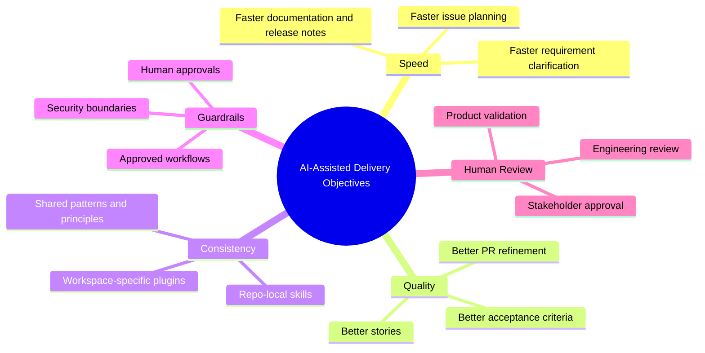

---

## 5. Executive Operating Model

At a high level, the model can be understood as a simple operating chain:

1. **Understand the need**
2. **Translate it into structured work**
3. **Align design and implementation**
4. **Build inside shared guardrails**
5. **Review and refine**
6. **Communicate what changed**

This executive framing matters because it shows that AI is being used as an operating capability across the lifecycle rather than as a narrow coding assistant.

The diagram below shows the six-stage executive operating model.

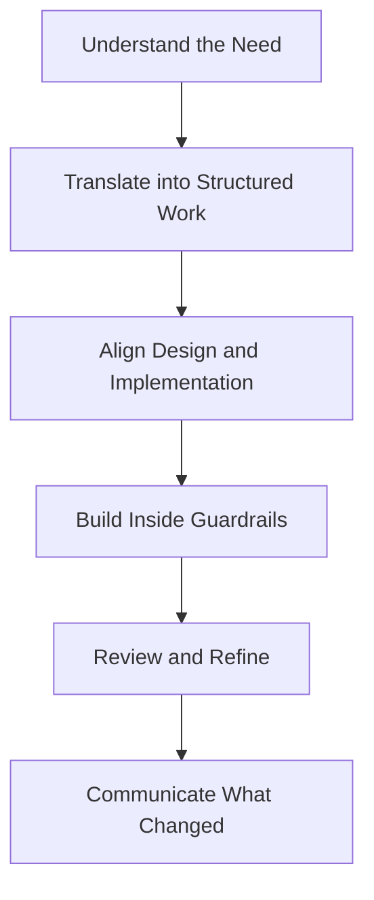

---

## 6. Where Each Tool Creates Business Value

### ChatGPT and Codex
Used to clarify requirements, summarize customer discussions, identify assumptions, and create structured planning artifacts.

### Codex
Used to create epics, stories, issue decomposition, documentation drafts, release notes, and PR refinements.

### Google Stitch
Used to accelerate UI ideation and improve alignment between product, UX, and frontend engineering.

### GitHub Boards
Used as the execution system where issues are organized, prioritized, assigned, and tracked.

### GitHub Copilot
Used to accelerate implementation work once issues and design direction are already clear.

### Greptile
Used to improve pull request quality through repository-aware automated review.

### MCP Servers
Used to connect AI assistance to trusted and current official sources, particularly useful for .NET and modern C# development.

### Workspace-Specific Plugins and Repo-Local Skills
Used to standardize AI behavior, encode local patterns, and reduce inconsistency across teams.

The diagram below maps each tool to the business value it supports.

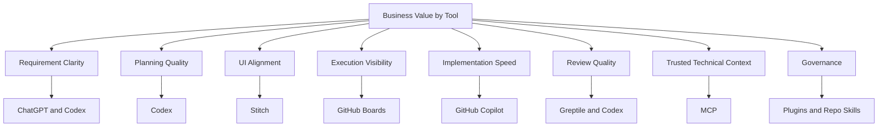

---

## 7. Requirement-to-Release Leadership View

The most useful way to understand this model is to follow the lifecycle from customer request to customer communication.

Customer inputs are clarified using ChatGPT and Codex. Approved requirements are translated into epics, stories, and segmented issues. If needed, Stitch helps generate early UI direction. GitHub Boards turns the planned work into visible execution. Copilot supports engineering delivery. Greptile and Codex strengthen pull request refinement. Codex then supports documentation updates and release-note preparation. Intercom is used to communicate the outcome externally.

This makes delivery more end-to-end, more visible, and more consistent.

The diagrams below show the operating flow and the cross-functional handoff sequence.

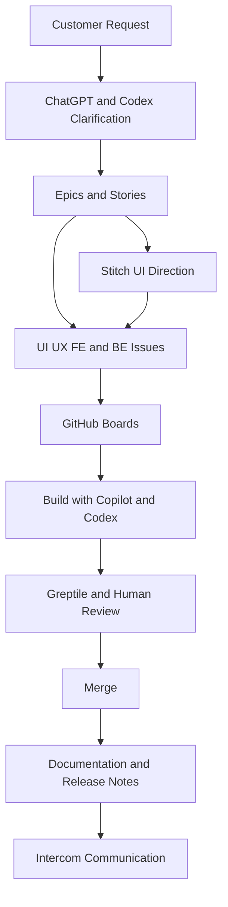

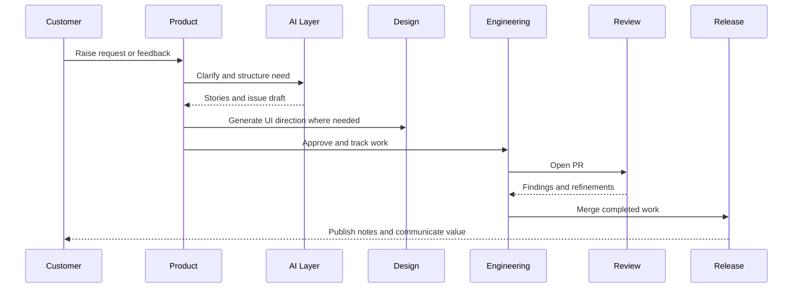

---

## 8. Executive View of Design and Engineering Alignment

One of the most important handoffs in product delivery is the transition from what should be built to what engineering can build clearly and confidently. Creolytix reduces friction in this handoff by combining Stitch for visual exploration and Codex for structured decomposition.

This matters because UI ambiguity often creates downstream frontend churn, backend mismatch, or repeated clarification cycles. By generating early UI concepts and then explicitly breaking work into UI/UX, frontend, and backend streams, teams align sooner and execute more predictably.

The diagram below shows how visual exploration and structured decomposition converge into aligned execution.

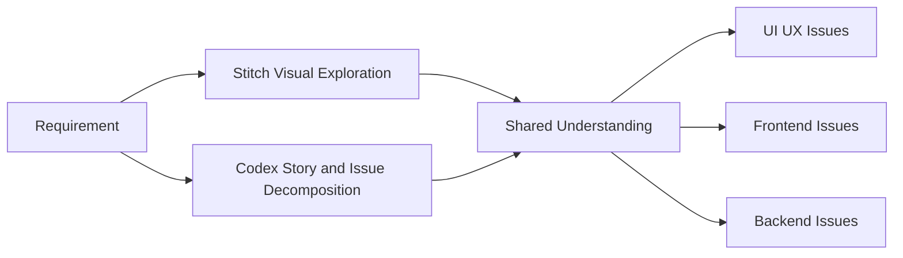

---

## 9. Governance: The Most Important Executive Control

The strongest differentiator in the Creolytix model is governance. AI adoption fails at scale when it becomes individualized and inconsistent. Different developers create different prompt sets, different review expectations, different coding habits, and different interpretations of what good looks like.

Creolytix avoids this by using workspace-specific Codex plugins and repo-local skills. Together, they establish common operating boundaries and local engineering expectations.

This creates three executive advantages:

- **Predictability**: teams work within known patterns
- **Reviewability**: generated output is easier to assess and approve
- **Scalability**: AI adoption can expand without creating uncontrolled drift

The diagrams below show the internal control model and the contrast between standardized adoption and fragmented adoption.

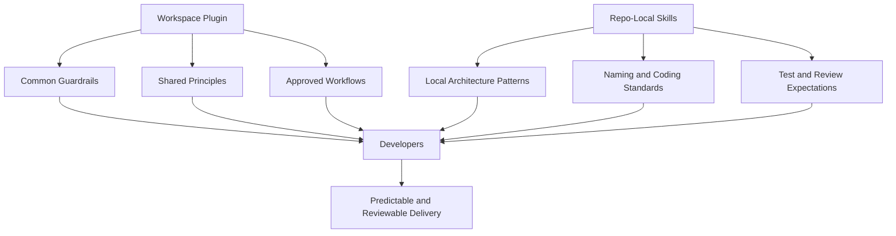

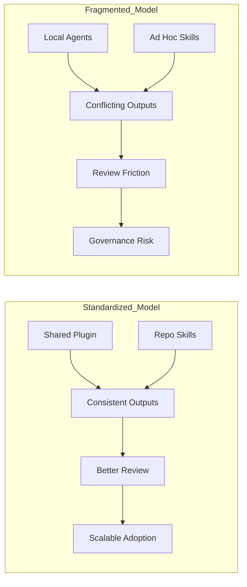

---

## 10. Full-Stack Context and Repository Strategy

Creolytix operates across repositories with different technical profiles. That makes repository-aware AI usage essential.

The backend repository `Creolytix-GmbH/l3-net-creolytix-engr` is overwhelmingly C#, which makes current .NET guidance, backend architectural consistency, and backend-specific repo skills especially important.

The frontend repository `Creolytix-GmbH/l3-react-creolytix-engr` is primarily TypeScript and SCSS, which makes frontend decomposition, design alignment, component consistency, and UI review context especially important.

This is why our approach emphasizes:
- repo-local skills
- trusted context through MCP
- full-stack review with Greptile
- shared governance across repositories

The diagrams below show the repository strategy and the technical composition of the main application layers.

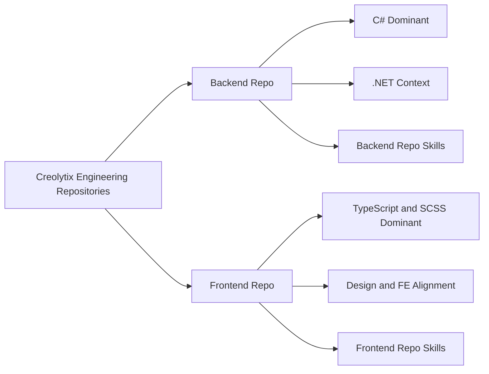

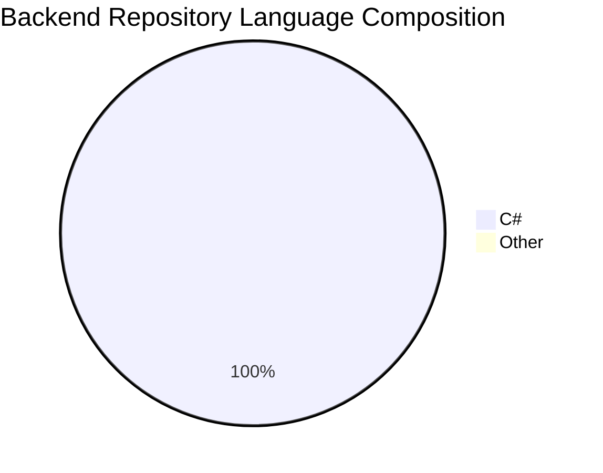

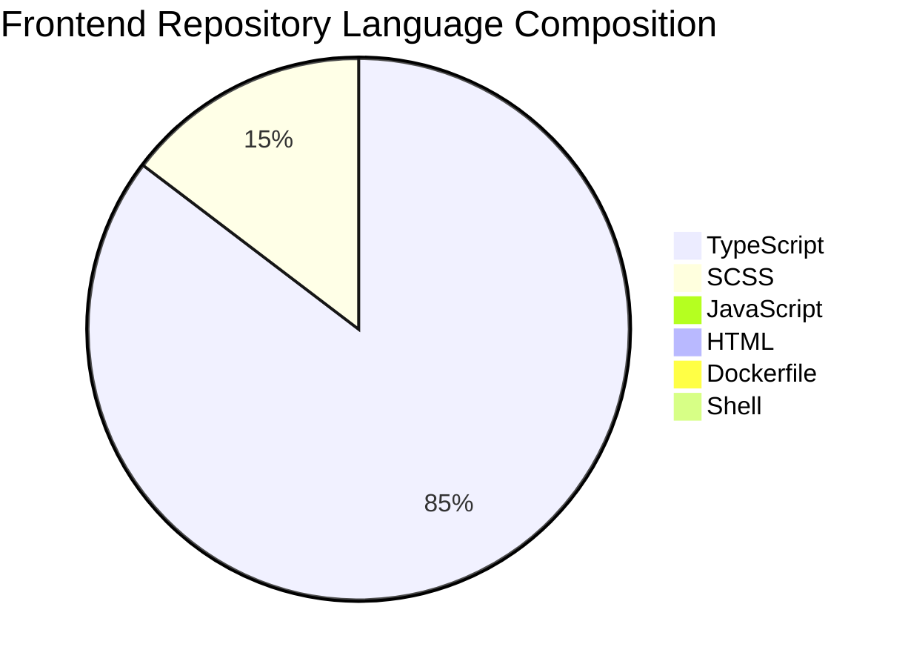

---

## 11. Review, Documentation, and Release Communication

A key executive advantage of this model is that it extends beyond implementation. Creolytix uses AI not only to help produce work, but also to improve how work is reviewed, documented, and communicated.

Greptile and Codex improve the PR refinement loop. Codex supports documentation maintenance so repositories stay clearer over time. Codex also helps prepare release notes from merged work, and those notes are then adapted for publication in Intercom.

This creates better operational continuity between build, review, and communication.

The diagram below shows how implementation flows into review, documentation, and customer communication.

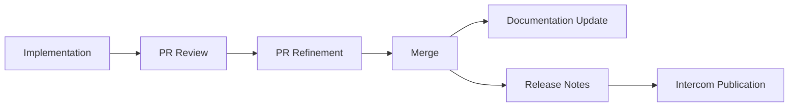

---

## 12. Risks This Model Helps Reduce

This operating model helps reduce several categories of delivery risk:

- ambiguity in customer requirements
- poor planning handoffs
- fragmented design-to-engineering transitions
- inconsistent coding patterns
- stale technical guidance
- incomplete review context
- documentation drift
- weak customer release communication

From a leadership standpoint, the model is valuable because it improves both throughput and control.

The diagram below groups the main enterprise risks this model is designed to reduce.

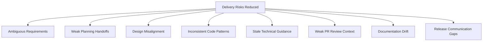

---

## 13. Benefits, Limitations, and Next Phase

### Benefits
This model improves speed, quality, consistency, and communication across the delivery lifecycle. It strengthens the path from customer request to delivered value.

### Limitations
AI still requires high-quality context, disciplined review, and human judgment. Governance remains essential. These tools assist expertise. They do not replace it.

### Next Phase
The next phase is to deepen reuse and strengthen scale:
- expand curated skill libraries
- improve cross-repository context
- increase trusted MCP integrations
- further standardize release workflows
- continue maturing the shared AI operating model

The diagram below summarizes the current value, the operating constraints, and the next direction of travel.

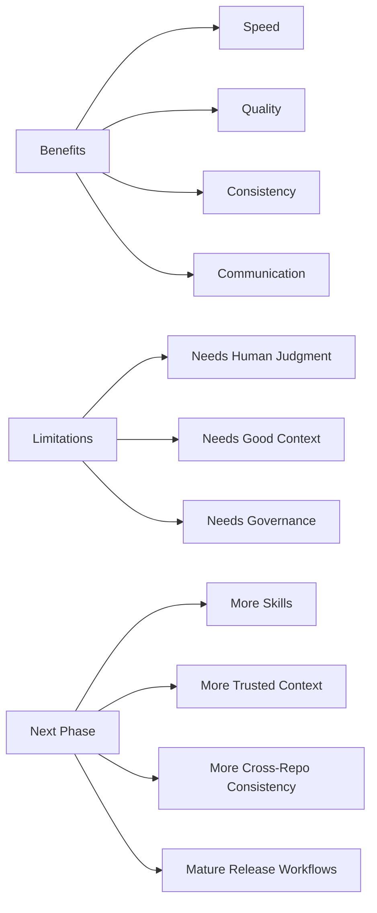

---

## 14. Final Leadership Takeaway

Creolytix is building an AI-enabled software delivery capability that is both high leverage and governable. The key success factor is not any individual tool. It is the way the tools are integrated inside a standardized operating model with shared controls, repo-local skills, human review, and clear accountability.

That gives leadership a practical path to scale AI adoption without accepting unnecessary inconsistency or risk. It also creates a stronger link between customer needs, engineering execution, and customer communication.

In short, this model enables Creolytix to deliver software faster, more consistently, and with stronger operational control.

The diagram below summarizes the executive outcome of the overall model.

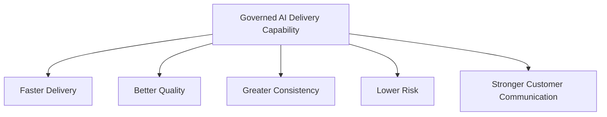
