# Creolytix AI-Assisted Software Delivery Model
## A Governed Operating Framework with Repository-Based Evidence

## 📌 Executive Summary

Creolytix is establishing a governed AI-assisted software delivery model. AI is integrated across the full lifecycle, from requirement clarification to release communication. The objective is not coding acceleration alone. The objective is measurable improvement in speed, quality, consistency, governance, and customer communication.

The management issue is clear. AI tools can now support nearly every stage of software development. ChatGPT and Codex can clarify customer needs and structure work. Codex and GitHub Boards can decompose execution into issues and stories. Google Stitch can accelerate early UI direction. GitHub Copilot and Codex can support implementation. Greptile and Codex can improve review quality. MCP-connected context can ground AI outputs in trusted technical sources. Codex and ChatGPT can support documentation and release communication.

If these tools are used inconsistently, the result is predictable: fragmented practices, review friction, architectural drift, and avoidable delivery risk. The relevant question is therefore not whether AI tools should be used. The relevant question is whether they should be integrated into a controlled, repository-aware, and reviewable operating model.

The Creolytix model addresses this through workspace-level controls, repository-local plugins and guardrails, templates, workflows, and explicit human approval points. This converts AI from a set of local productivity experiments into a governed delivery capability.

This model is credible because it is already partially implemented. In the backend repository `Creolytix-GmbH/l3-net-creolytix-engr`, the workspace marketplace configuration, the `creolytix-codex` plugin, the default prompt behavior, and the `creolytix-backend-guardrails` skill provide concrete evidence of repository-native AI governance. Additional workflow and template assets are present in the backend and frontend repositories.

> **Leadership takeaway:** Creolytix should manage AI-assisted delivery as a governed operating capability with explicit lifecycle integration, repository-local controls, human accountability, and measurable outcomes.

## 🧭 What Leadership Should Remember

- AI is now usable across the full software delivery lifecycle.
- Unmanaged AI usage creates delivery, quality, and governance risk.
- Creolytix already has verified implementation elements in production repositories.
- The next step is not experimentation. The next step is standardization, rollout, and measurement.

## 🔎 Evidence Snapshot

- Workspace marketplace configuration exists in the backend repository.
- `creolytix-codex` is registered and installed by default.
- `creolytix-backend-guardrails` exists as a real repository-local skill.
- Reference material and validation scripts exist.
- Backend and frontend repositories already contain workflow and template assets.

---

# ⚠️ Part 1. The Problem & The Risks

## 1. Why This Matters Now

Software organizations are under pressure to deliver faster while maintaining quality, control, and customer trust. At the same time, AI tools are becoming capable across requirement analysis, planning, design exploration, implementation support, review preparation, documentation, and release communication.

This creates both opportunity and risk. If AI is integrated deliberately, it can reduce ambiguity, improve execution readiness, and increase delivery efficiency across the lifecycle. If it is adopted inconsistently, it can increase variation in how work is defined, implemented, reviewed, documented, and communicated.

Timing matters. Standardization is easier before fragmented habits become embedded across repositories and teams. For Creolytix, the issue is no longer whether AI should participate in software delivery. The issue is whether AI should be embedded in a controlled, repository-aware, and reviewable operating model.

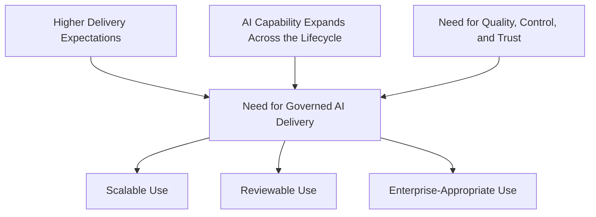

## 2. The Core Delivery Problems

The underlying challenge is operational. Customer needs often begin as conversations, observations, or incomplete requests rather than implementation-ready work. Converting these inputs into clear requirements, structured issues, and well-scoped engineering tasks is often inconsistent.

The same inconsistency continues downstream. Planning quality can vary by team or individual. Design intent is not always translated clearly enough into implementation-ready work. Implementation quality can depend too heavily on local habits rather than shared engineering expectations. Documentation and release communication are often treated as follow-on tasks rather than integrated parts of delivery.

These problems create delay before coding begins, rework during review, and communication gaps after merge. AI does not remove these problems automatically. Without a defined operating model, it can amplify inconsistency rather than reduce it.

| Delivery Problem | Operational Effect | Business Consequence |
|---|---|---|
| Ambiguous requirements | Unclear scope, assumptions, and acceptance boundaries | Rework and slower approvals |
| Weak structuring of customer input | Poor issue and story quality | Lower execution readiness |
| Planning inconsistency | Variable decomposition and prioritization | Delivery inefficiency |
| Weak design-to-implementation alignment | Rework between planning and build stages | Slower execution |
| Uneven implementation quality | Different coding and review outcomes across teams | Higher correction cost |
| Documentation lag | Knowledge is not updated at the same pace as code | Reduced maintainability |
| Release communication lag | Customer-visible change is not clearly explained | Lower value realization |

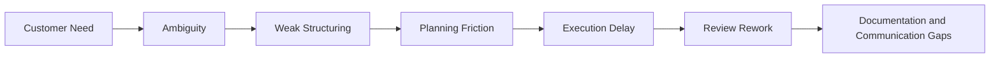

## 3. The Risks of Uncontrolled AI Usage

Uncontrolled AI adoption creates a second layer of risk on top of existing delivery problems. When prompting styles, local tools, and implementation approaches differ by individual, output quality becomes inconsistent and difficult to govern.

This has direct engineering consequences. AI that is not guided by repository context may generate code that does not fit the architecture, naming conventions, dependency injection patterns, validation expectations, or data-access standards of the codebase. Reviewers then spend time correcting preventable defects instead of focusing on correctness, intent, and design quality.

The risk extends beyond code generation. Fragmented AI usage can also weaken requirement quality, planning structure, design alignment, documentation consistency, PR preparation, and release communication. Over time, this reduces cross-team alignment and increases the cost of delivery and maintenance.

The management issue is therefore clear: ungoverned AI usage does not simply create isolated technical defects. It creates a repeatability and control problem across the full software development and delivery lifecycle.

| Risk Category | Example Failure Mode | Operational Impact |
|---|---|---|
| Requirement risk | AI-generated stories miss business assumptions | Misaligned implementation |
| Architectural risk | Wrong layer or module placement | Structural inconsistency and refactoring overhead |
| Convention risk | Naming drift from discovery and scanning expectations | Lower maintainability and broken conventions |
| Data risk | Missing MongoDB index registration | Runtime or performance problems |
| Validation risk | Checks occur late or inconsistently | Late defect detection |
| Review risk | PRs contain preventable baseline defects | Higher review cost and slower merge |
| Documentation risk | AI output does not match actual implementation | Documentation drift |
| Communication risk | Release notes and customer updates are incomplete or delayed | Weaker stakeholder clarity |
| Governance risk | Teams use inconsistent AI methods | Low cross-repository consistency |

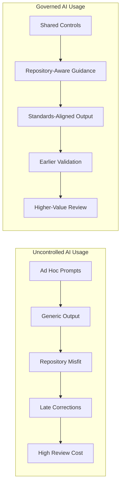

## 4. Business Impact if Left Unaddressed

If these issues are not addressed, AI adoption may increase activity without improving delivery performance. Teams may appear faster in isolated tasks while overall delivery remains slowed by rework, inconsistent quality, and prolonged review cycles.

The business impact is predictable. Delivery becomes less consistent across repositories. Review effort becomes more expensive. Documentation and release communication become less reliable. AI may be present at many stages, but without governance it will not deliver consistent enterprise value.

The leadership implication is direct: AI without governance can increase local throughput while reducing system-wide control.

| Risk Area | Likely Outcome if Unaddressed |
|---|---|
| Requirement ambiguity | Higher rework and slower delivery readiness |
| Inconsistent planning | Lower issue quality and weaker execution flow |
| Weak design alignment | More downstream change and correction |
| Repository-blind AI usage | More correction work in implementation and review |
| Weak governance | Low standardization across teams |
| Documentation and communication lag | Reduced internal and customer clarity |

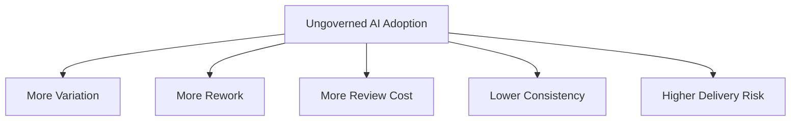

---

# 🛠️ Part 2. The Ideal Solution & The Creolytix Plugin

## 5. Target Operating Model

The target state is not unrestricted AI usage. The target state is governed AI support across the full software delivery lifecycle. In this model, AI assists at every major stage: requirement clarification, work structuring, design alignment, implementation support, review refinement, documentation maintenance, and release communication.

This requires two forms of control. First, there must be workspace-level consistency so that AI is used within shared expectations rather than isolated local habits. Second, there must be repository-level guidance so that output is aligned with the actual architecture, conventions, and workflows of the codebase being changed.

Human accountability remains explicit throughout. AI may draft, propose, summarize, and assist. Product, architecture, engineering, reviewers, and release stakeholders remain accountable for decisions, approvals, and final outcomes.

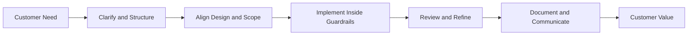

## 6. 🤖 AI Tooling Across the Full Delivery Lifecycle

Creolytix uses AI as a lifecycle capability rather than as a coding-only tool. The objective is to improve the quality and speed of the full delivery chain, from customer input to customer communication.

At the front of the lifecycle, ChatGPT and Codex help summarize customer discussions, clarify ambiguity, identify assumptions, and produce structured requirements. In planning, Codex helps draft epics, stories, acceptance criteria, and issue decomposition, while GitHub Boards provides the execution system for prioritization, sequencing, and tracking. In design-related work, Google Stitch supports early UI direction and design exploration. During implementation, GitHub Copilot and Codex support development productivity inside repository-aware controls. During review, Greptile and Codex help improve PR quality and interpret repository-aware findings. MCP-connected context helps ground AI outputs in authoritative, current technical sources. After merge, Codex and ChatGPT support documentation updates, release-note drafting, and customer-facing communication preparation.

This integrated use is important because delivery quality is shaped before coding starts and after code is merged, not only during implementation.

| Delivery Stage | Primary Tools | Role | Intended Benefit |
|---|---|---|---|
| Requirement clarification | ChatGPT, Codex | Summarize needs, identify ambiguity, structure requirements | Better requirement quality |
| Planning and decomposition | Codex, GitHub Boards | Draft epics, stories, acceptance criteria, sequence work | Faster execution readiness |
| Design alignment | Google Stitch, Codex | Explore UI direction and support option framing | Better design-to-build alignment |
| Implementation | GitHub Copilot, Codex | Accelerate coding inside repository guardrails | Faster development with better fit |
| Repository-aware review | Greptile, Codex | Improve PR quality and interpret review findings | Higher-value review |
| Trusted technical context | MCP-connected sources | Ground AI output in authoritative current references | Better accuracy and relevance |
| Documentation and release communication | Codex, ChatGPT | Draft technical updates, release notes, customer updates | Clearer downstream communication |

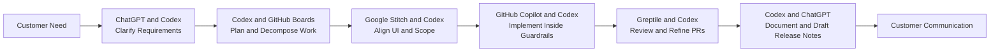

## 7. 📊 The Management Model: Standardized, Governed, Measurable

A mature AI-assisted delivery model has clear operating characteristics. Prompting is not individual and inconsistent; it is guided by shared standards. AI output is not generic; it is repository-aware. Review does not focus on preventable baseline issues; it focuses on correctness, business intent, and higher-value concerns.

Good practice also extends beyond coding. Requirements are clarified more systematically. Issues and stories are better structured. Documentation is updated as part of delivery rather than postponed. Release notes are drafted with greater speed and consistency. The practical objective is repeatability.

| Characteristic | Unstructured State | Governed State |
|---|---|---|
| Prompting approach | Individual and inconsistent | Shared and controlled |
| AI context | Generic and tool-dependent | Repository-aware and standards-aware |
| Lifecycle coverage | Mostly coding-focused | Full lifecycle integration |
| Planning output | Variable issue and story quality | More structured and repeatable |
| Review focus | Preventable defects and corrections | Correctness, design, and business intent |
| Documentation | Often delayed | Integrated into delivery |
| Release communication | Variable and manual | Structured and more repeatable |

### Before vs After Governed AI Delivery

| Area | Before Governed Model | After Governed Model |
|---|---|---|
| Requirement clarity | Variable | More structured |
| Planning | Inconsistent | Repeatable |
| Implementation | Tool-dependent | Repository-aware |
| Review | Corrective | Higher-value |
| Documentation | Delayed | Integrated |
| Communication | Inconsistent | Structured |

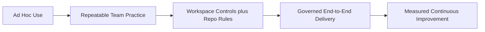

## 8. 🧩 The Role of the Creolytix Plugin

The Creolytix plugin is the practical control mechanism that translates AI governance into repeatable behavior. Its role is not merely to make Codex available. Its role is to standardize how Codex behaves within the delivery environment.

This matters for two reasons. First, it creates consistency. If the plugin is centrally registered and installed by default, governance does not depend on whether individuals remember to apply it. Second, it creates relevance. By invoking repository-local guardrails, the plugin connects AI behavior to the actual needs and standards of the codebase.

In practical terms, the plugin reduces variance before coding starts. It increases the likelihood that implementation begins with the correct expectations for architecture, naming, validation, documentation, and finishing checks. That improves not only code quality, but also the efficiency of review.

| Creolytix Plugin Function | Practical Effect |
|---|---|
| Installed by default | Governance is applied broadly rather than selectively |
| Standards-focused capability definition | Engineering expectations are made explicit early |
| Default prompt behavior | Repository-local guardrails are invoked consistently |
| Integration with repo-local skills | Guidance is specific to the codebase, not generic |
| Reusable control layer | Similar governance can be scaled across repositories |

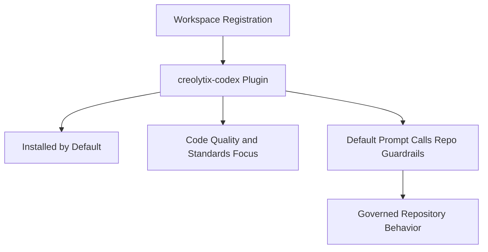

## 9. 🛡️ Governance and Human Accountability

The Creolytix model depends on layered governance rather than a single control. Workspace-level registration provides consistency across environments. Repository-local plugins and skills provide codebase-specific guidance. Templates and workflows provide delivery structure. Human review ensures that decision-making and approval remain with accountable roles.

This layered model is important because no single mechanism is sufficient on its own. A plugin without human review can create false confidence. Human review without repository-aware AI controls leaves preventable variation unresolved. Templates and workflows without operating guidance can standardize process while leaving quality inconsistent.

The governance design therefore combines machine assistance with human accountability. Product owns requirement intent and business validation. Architecture owns structural integrity. Engineering owns implementation correctness. Reviewers own merge approval. Release stakeholders own customer-facing communication approval.

| Delivery Activity | AI Role | Human Accountability |
|---|---|---|
| Clarify requirements | Support analysis and structuring | Product |
| Structure issues and stories | Draft and refine | Product and Engineering |
| Align design and implementation | Support analysis and option framing | Product, Architecture, Engineering |
| Implement changes | Assist coding and completion | Engineering |
| Review and refine PRs | Support review preparation | Reviewer |
| Approve merge | No approval authority | Reviewer |
| Draft release notes | Support drafting and summarization | Release stakeholder |

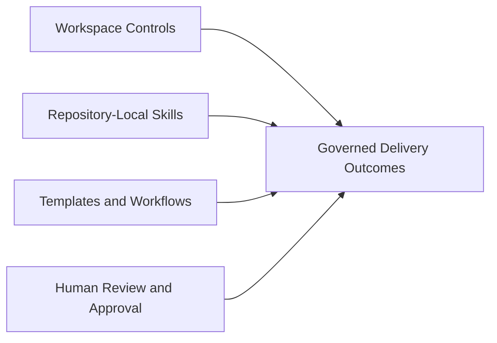

## 10. 📈 Expected Benefits

A governed AI-assisted model should improve both throughput and control. The expected value is not limited to faster implementation. It includes faster conversion of customer input into execution-ready work, improved consistency of engineering output, more efficient review, better documentation discipline, and clearer release communication.

These benefits should be interpreted operationally. Faster delivery matters when it reduces waiting and rework. Quality matters when it reduces preventable correction cycles. Consistency matters when it improves scalability across repositories and teams. Communication matters when customers and stakeholders can clearly understand what changed and why.

| Benefit Dimension | Expected Improvement |
|---|---|
| Speed | Faster requirement-to-execution readiness |
| Quality | Better standards alignment and fewer preventable defects |
| Consistency | More uniform outputs across repositories and teams |
| Review efficiency | Higher-value reviewer focus |
| Documentation | Faster and more reliable updates after change |
| Communication | More consistent release-note preparation |

### KPI Scorecard Framework

| Dimension | KPI | Target Direction |
|---|---|---|
| Speed | Time from request to issue readiness | Down |
| Quality | PR revision rounds before approval | Down |
| Consistency | Percentage of repositories using approved AI controls | Up |
| Documentation | Time from merge to documentation update | Down |
| Communication | Time from merge to release-note draft | Down |

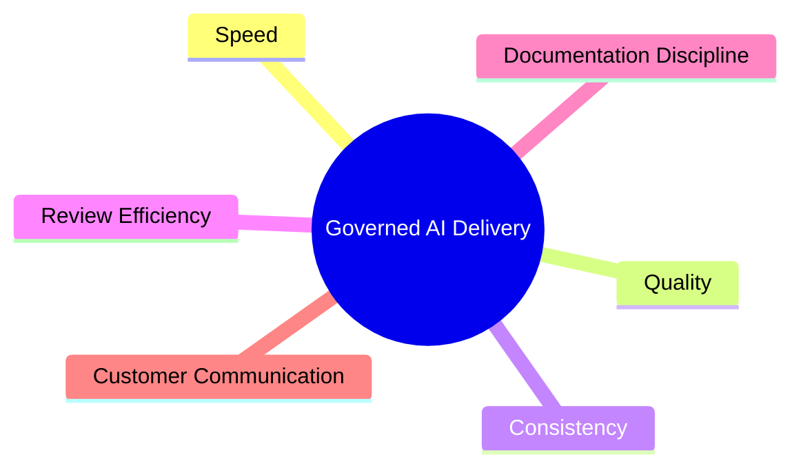

---

# ✅ Part 3. Real-World Implementation (Evidence-Integrated)

## 11. Verified Implementation Today

The model is not theoretical. In the backend repository `Creolytix-GmbH/l3-net-creolytix-engr`, Creolytix already has concrete implementation elements that demonstrate repository-native AI governance.

The repository contains a workspace marketplace configuration under `.agents/plugins/marketplace.json`. That marketplace defines the workspace and registers the `creolytix-codex` plugin. The plugin is marked as installed by default and includes capabilities focused on code quality and standards. Its default prompt behavior directs Codex to use the repository-local skill `creolytix-backend-guardrails`.

This skill is not merely declarative. The repository also contains associated reference material and a validation script. In addition, backend and frontend repositories contain issue templates, workflows, and, on the frontend side, a pull request template. Together, these assets demonstrate that Creolytix already has a real foundation for governed AI-assisted delivery.

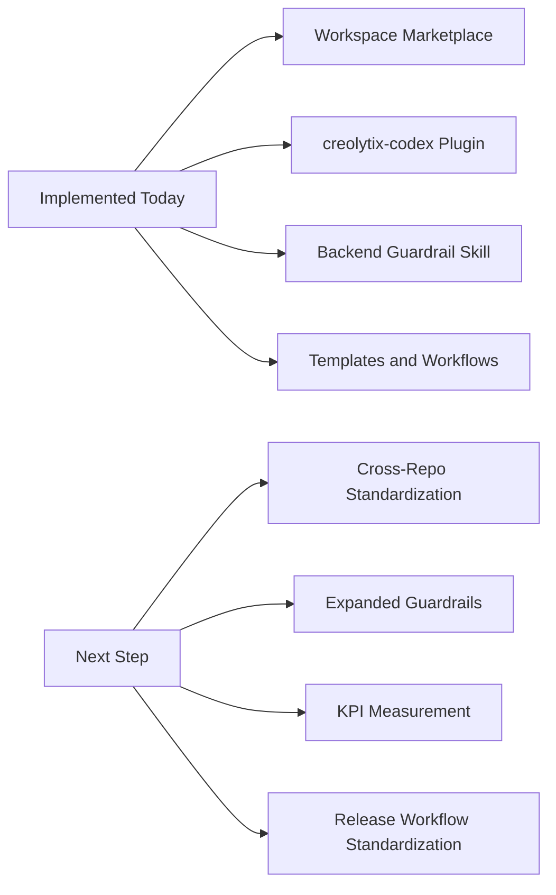

## 12. 🔎 Verified Repository Evidence

The following repository assets provide concrete evidence that governed backend AI usage is already implemented in practice rather than described only at policy level.

| Evidence Area | Repository Asset | What It Demonstrates |
|---|---|---|
| Workspace registration | `Creolytix-GmbH/l3-net-creolytix-engr/.agents/plugins/marketplace.json` | Workspace-level AI governance exists |
| Plugin metadata | `Creolytix-GmbH/l3-net-creolytix-engr/plugins/creolytix-codex/.codex-plugin/plugin.json` | The plugin and its capabilities are formally defined |
| Guardrail skill | `Creolytix-GmbH/l3-net-creolytix-engr/plugins/creolytix-codex/skills/creolytix-backend-guardrails/SKILL.md` | Repository-local backend guidance exists |
| Reference material | `Creolytix-GmbH/l3-net-creolytix-engr/plugins/creolytix-codex/skills/creolytix-backend-guardrails/references/authoritative-files.md` | The skill is grounded in authoritative repository context |
| Validation script | `Creolytix-GmbH/l3-net-creolytix-engr/plugins/creolytix-codex/skills/creolytix-backend-guardrails/scripts/check-creolytix-backend-guardrails.ps1` | Guardrails include executable quality checks |
| Backend governance assets | `Creolytix-GmbH/l3-net-creolytix-engr/.github/ISSUE_TEMPLATE` and `.github/workflows` | Intake and workflow governance are present |
| Frontend governance assets | `Creolytix-GmbH/l3-react-creolytix-engr/.github/ISSUE_TEMPLATE`, `.github/PULL_REQUEST_TEMPLATE.md`, and `.github/workflows` | Frontend governance foundations are present |

## 13. 🧪 Real-Work Example: AI Across the Full Delivery Path

A practical delivery scenario shows how the model works in operation. Consider a customer request to improve a reporting workflow. The initial request may contain business intent, user pain points, and expected outcomes, but not yet a clear engineering structure.

In a governed model, ChatGPT and Codex first support clarification. The request is summarized, assumptions are surfaced, and the need is translated into structured requirements. Codex then helps draft stories and issue breakdowns, while GitHub Boards supports sequencing and tracking. If the change affects a user-facing flow, Google Stitch can support early UI direction and scope alignment.

Implementation then proceeds inside repository-aware controls. In the backend repository, the `creolytix-codex` plugin and `creolytix-backend-guardrails` skill guide coding expectations around placement, naming, documentation, validation, and indexing, while GitHub Copilot supports implementation productivity. A pull request is then reviewed with stronger baseline quality. Greptile and Codex help refine review findings and improve PR quality, allowing reviewers to focus more on business correctness and design fit. MCP-connected sources can support access to trusted current technical context where needed. After merge, Codex and ChatGPT support documentation updates and release-note drafting, improving the clarity of internal and customer communication.

This example matters because it demonstrates AI integration across the full software development and delivery path rather than only the coding phase.

| Delivery Step | Primary Tools | AI Contribution | Human Accountability | Governance Mechanism |
|---|---|---|---|---|
| Clarify customer request | ChatGPT, Codex | Summarizes need and identifies ambiguity | Product | Shared operating approach |
| Structure work | Codex, GitHub Boards | Drafts stories, issues, acceptance criteria, tracks work | Product and Engineering | Templates and workflow discipline |
| Align design and scope | Google Stitch, Codex | Supports option framing and UI direction | Product, Design, Engineering | Review and approval checkpoints |
| Implement backend change | GitHub Copilot, Codex | Assists coding | Engineering | `creolytix-codex` and backend guardrails |
| Review PR | Greptile, Codex | Supports refinement and review interpretation | Reviewer | PR process and repository context |
| Use trusted technical context | MCP-connected sources | Grounds AI output in current references | Engineering and Reviewer | Controlled source usage |
| Update documentation | Codex, ChatGPT | Drafts updates | Engineering and Reviewer | Repo workflow discipline |
| Prepare release notes | Codex, ChatGPT | Drafts communication | Release stakeholder | Human approval before publication |

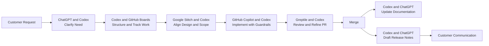

## 14. Current State and Next Step

Creolytix already has a meaningful foundation for governed AI-assisted delivery. The backend repository provides clear evidence of workspace registration, plugin-based Codex governance, repository-local skill guidance, and executable validation support. This is a substantive implementation base rather than a conceptual aspiration.

The frontend repository currently shows governance foundations through issue templates, a pull request template, and workflows. This indicates that governance is already present in repository-native form, even if backend Codex controls are currently the stronger verified example.

The next maturity step is therefore not invention, but extension. Creolytix should expand repository-aware controls across more repositories, increase cross-repository standardization, and begin measuring operational outcomes through a defined scorecard.

| Area | Current State | Next Step |
|---|---|---|
| Backend AI governance | Materially implemented | Extend to more backend domains and workflows |
| Frontend governance | Templates and workflows present | Add equivalent repository-local AI controls where appropriate |
| Cross-repository consistency | Defined conceptually | Standardize rollout patterns across repositories |
| Tool integration visibility | Present in practice, not yet uniformly formalized | Make tool-by-stage usage explicit across repositories |
| Measurement | Value is identifiable | Introduce KPI-based reporting |
| Release communication flow | Supported conceptually | Standardize and measure the downstream workflow |

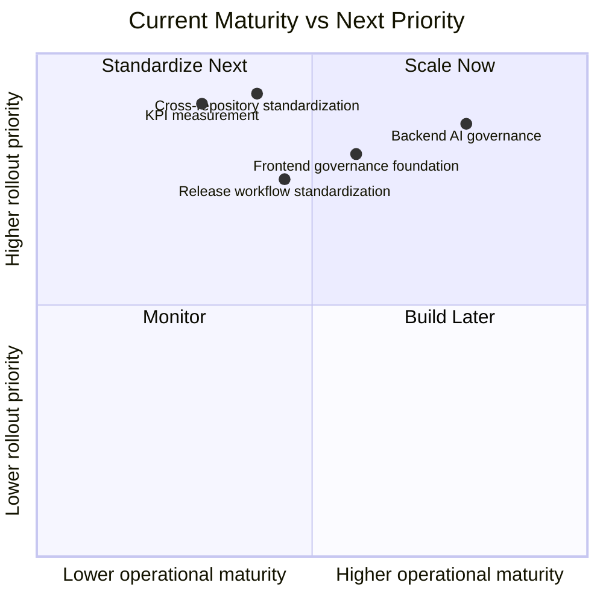

## 🎯 Leadership Conclusion

Creolytix already has real evidence of governed AI adoption in its delivery environment. The backend repository demonstrates that workspace-level plugin registration, repository-local guardrails, and executable quality checks can be combined into a practical operating model. This shows that governance can be implemented inside the repositories where delivery work actually occurs.

The strategic implication is direct. Creolytix should treat AI-assisted delivery as a managed capability that integrates AI tools across the full lifecycle while improving both throughput and control. The priority is not more tool experimentation. The priority is scaling a governed model across repositories, preserving clear human accountability, and measuring whether the model improves speed, quality, consistency, review efficiency, and communication outcomes.

The next step is controlled expansion with evidence-based measurement.

> **Bottom line:** Creolytix should scale governed AI-assisted delivery as an operating model, not permit AI adoption to remain a set of local, unmanaged practices.

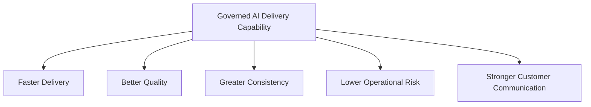

## ✅ Leadership Decisions Required

1. Confirm governed AI-assisted delivery as a strategic operating capability.
2. Standardize workspace and repository controls across priority repositories.
3. Define KPI tracking for speed, quality, consistency, documentation, and communication.
4. Expand repository-local guardrails beyond the current backend example.

# Appendix

## Appendix A. Verified Repository References

The following repository assets are the principal evidence points referenced in this document:

- `Creolytix-GmbH/l3-net-creolytix-engr/.agents/plugins/marketplace.json`
- `Creolytix-GmbH/l3-net-creolytix-engr/plugins/creolytix-codex/.codex-plugin/plugin.json`
- `Creolytix-GmbH/l3-net-creolytix-engr/plugins/creolytix-codex/skills/creolytix-backend-guardrails/SKILL.md`
- `Creolytix-GmbH/l3-net-creolytix-engr/plugins/creolytix-codex/skills/creolytix-backend-guardrails/references/authoritative-files.md`
- `Creolytix-GmbH/l3-net-creolytix-engr/plugins/creolytix-codex/skills/creolytix-backend-guardrails/scripts/check-creolytix-backend-guardrails.ps1`
- `Creolytix-GmbH/l3-net-creolytix-engr/.github/ISSUE_TEMPLATE`
- `Creolytix-GmbH/l3-net-creolytix-engr/.github/workflows`
- `Creolytix-GmbH/l3-react-creolytix-engr/.github/ISSUE_TEMPLATE`
- `Creolytix-GmbH/l3-react-creolytix-engr/.github/PULL_REQUEST_TEMPLATE.md`
- `Creolytix-GmbH/l3-react-creolytix-engr/.github/workflows`
