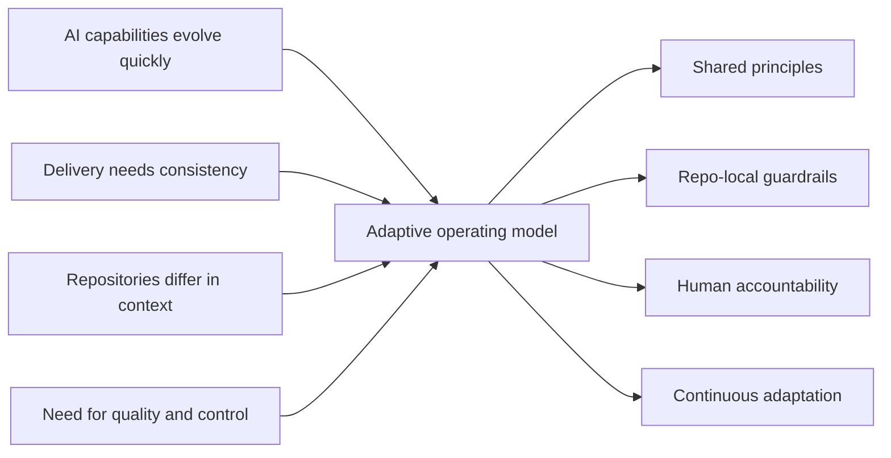
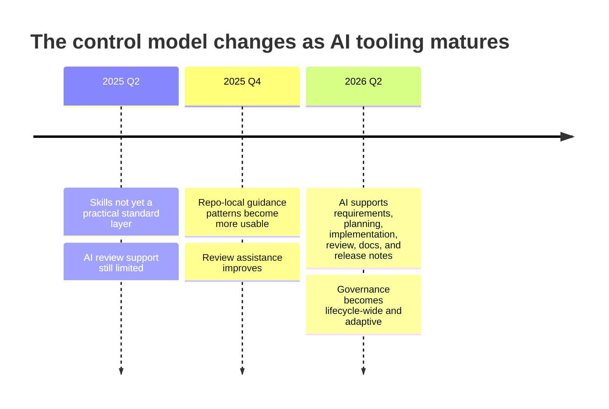
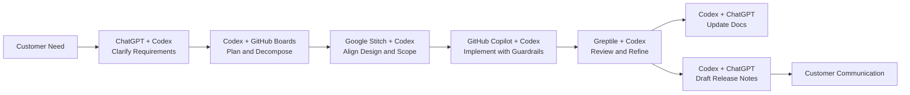
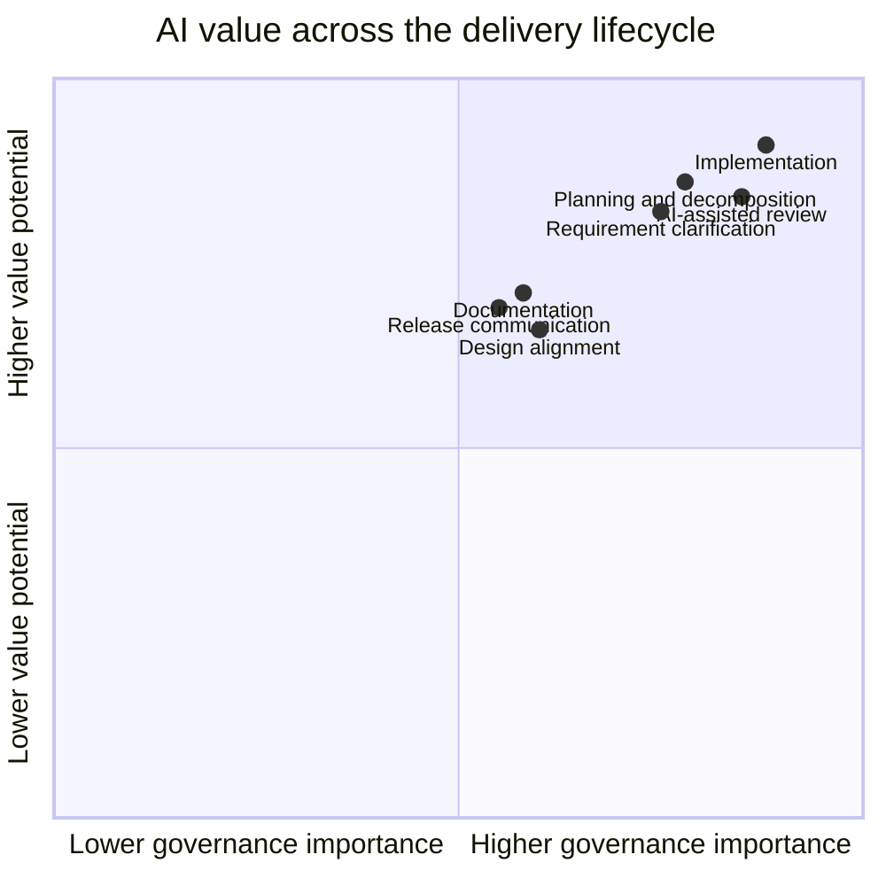
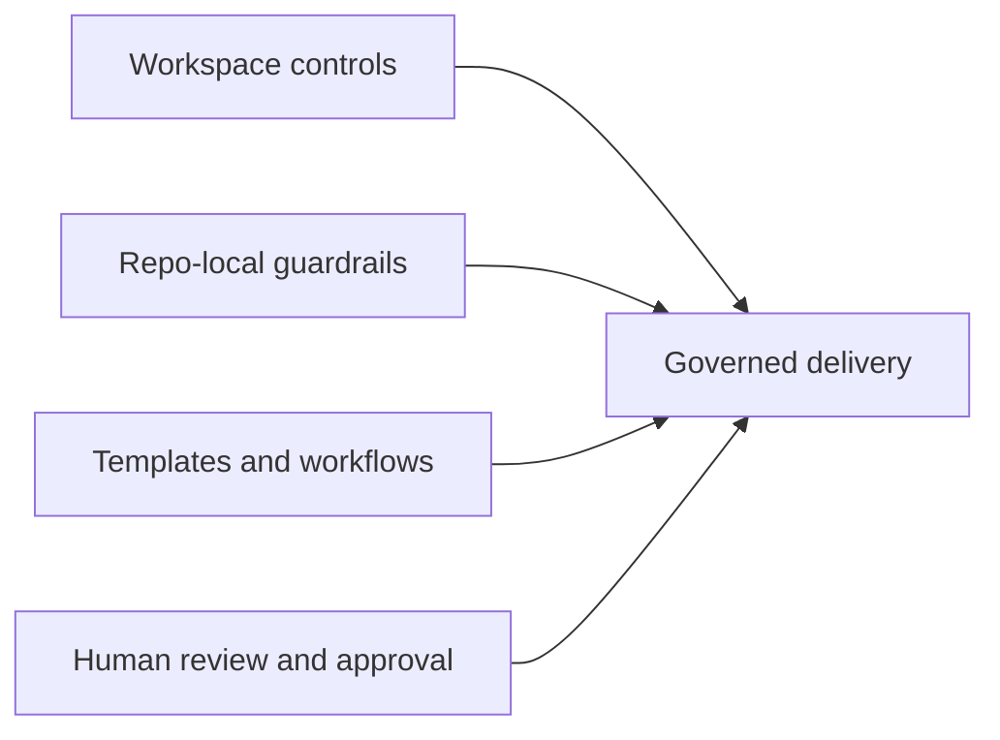
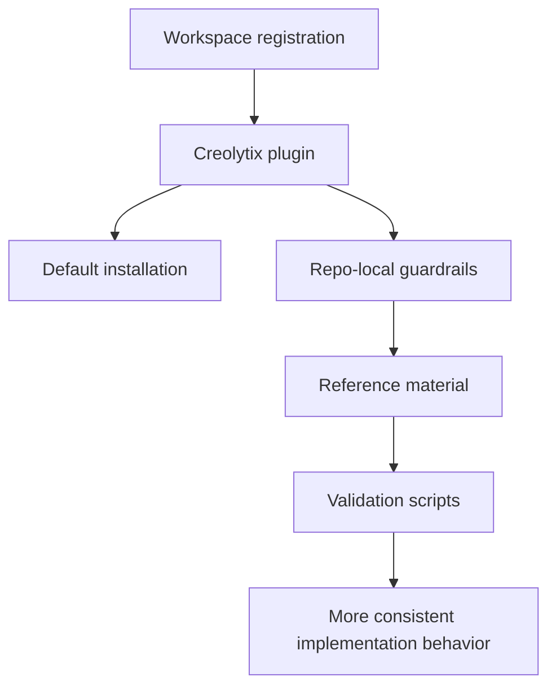
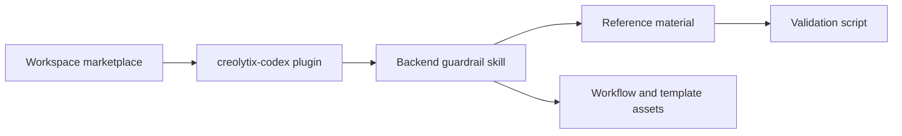
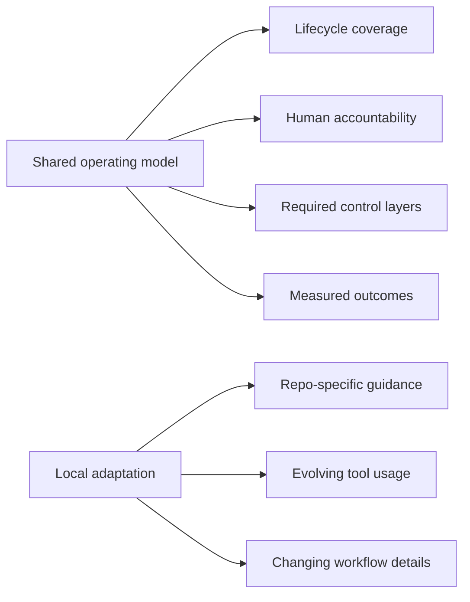
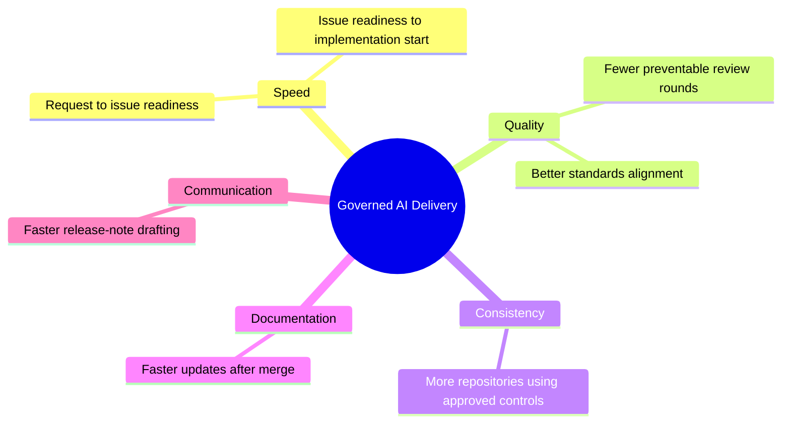
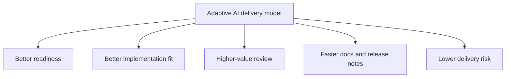

# Creolytix AI-Assisted Software Delivery Model
## An Adaptive Operating Model for AI Across the Full Delivery Lifecycle

## Executive Summary

AI-assisted software delivery is no longer limited to code generation. It now reaches across requirement clarification, planning, design alignment, implementation, review, documentation, and release communication.

That breadth creates a management challenge. AI is becoming more useful across the lifecycle, but it is also changing very quickly. A year ago, repository-local “skills” were not yet a meaningful governance layer in everyday practice. A year ago, AI code review was far less effective than it is now. As the tooling improves, the practical control model changes with it.

This is why AI delivery is better understood as an operating model than as a fixed rule set. The durable elements are not individual prompts, model choices, or one permanent workflow design. The durable elements are shared principles, repository-aware controls, human accountability, and continuous adjustment as the tools evolve.

The result is a governed but adaptable model: common direction at workspace level, repository-local guidance where context matters, human approval where decisions matter, and lifecycle-wide use of AI where value can be created.

---

# 1. Why AI Delivery Is an Operating Model, Not a Fixed Rulebook

The central issue is not whether AI participates in software delivery. It already does. The real issue is how that participation is structured.

A static global rule assumes the methods, tools, and control surfaces are relatively stable. AI tooling does not behave that way. Its useful patterns shift quickly. New control mechanisms appear. Review quality improves. Repository-aware guidance becomes more practical. What was weak or immature one year may become standard practice the next.

That makes rigid standardization brittle. It also makes fully unmanaged usage risky. The durable middle ground is an operating model: a shared structure for how AI participates, where controls exist, how accountability is maintained, and how adaptation happens over time.

## Why the model must stay adaptable

| Then | Now | What changed |
|---|---|---|
| “Skills” were not a practical control layer | Repository-local skills can shape AI behavior | Governance can sit closer to the codebase |
| AI review support was weak | AI-assisted review is increasingly useful | Review workflows can now include AI meaningfully |
| AI use was mostly coding-focused | AI now contributes before and after coding too | Governance must span the whole lifecycle |
| Tooling patterns were unstable | Better workflow integration is emerging | Control models are becoming more operational |

---

# 2. The Delivery Problem Before and After AI

Software delivery already contains ambiguity before any AI tool is introduced. Customer needs often begin as incomplete requests, conversations, or observations rather than implementation-ready work. Planning quality varies. Design intent does not always translate cleanly into implementation. Documentation and release communication often lag behind the code itself.

AI does not eliminate these problems by default. It can reduce them when used deliberately, but it can also amplify inconsistency when used without shared controls.

## Core delivery friction

| Delivery challenge | Typical effect |
|---|---|
| Ambiguous customer needs | Unclear scope and assumptions |
| Weak work structuring | Poor issue and story quality |
| Planning inconsistency | Uneven execution readiness |
| Weak design-to-build alignment | Rework during implementation |
| Variable implementation quality | Higher correction cost |
| Documentation lag | Knowledge drift |
| Release communication lag | Slower value realization |

## What unmanaged AI adds

| Risk area | Example of drift | Result |
|---|---|---|
| Requirements | AI-generated stories miss business assumptions | Misaligned implementation |
| Architecture | Code is placed in the wrong layer | Structural inconsistency |
| Conventions | Naming and patterns drift | Lower maintainability |
| Validation | Checks happen late or inconsistently | Late defect detection |
| Review | PRs contain preventable issues | Slower approvals |
| Documentation | AI output diverges from implementation | Documentation drift |
| Governance | Teams use different local methods | Low repeatability |

---

# 3. AI Tooling Across the Full Delivery Lifecycle

This is the most important concept in the model: AI is not only an implementation tool. Its value appears across the full path from customer need to customer communication.

## Lifecycle view

| Delivery stage | Main tools | AI role | Typical output | Human owner |
|---|---|---|---|---|
| Requirement clarification | ChatGPT, Codex | Summarize needs, identify ambiguity, structure requests | Clearer requirement draft | Product |
| Planning and decomposition | Codex, GitHub Boards | Draft epics, stories, tasks, acceptance criteria | Execution-ready work items | Product + Engineering |
| Design alignment | Google Stitch, Codex | Explore options and align intent | Better design/build alignment | Product + Design + Engineering |
| Implementation | GitHub Copilot, Codex | Assist coding inside repository context | Faster implementation | Engineering |
| AI-assisted review | Greptile, Codex | Improve PR quality and interpret findings | Better PR refinement | Reviewer + Engineering |
| Trusted technical context | MCP-connected sources | Ground outputs in authoritative references | Better technical accuracy | Engineering + Reviewer |
| Documentation | Codex, ChatGPT | Draft technical updates | Faster documentation updates | Engineering |
| Release communication | Codex, ChatGPT | Draft release notes and customer summaries | Faster communication readiness | Release stakeholder |

## What changes when AI is used lifecycle-wide

| Stage group | Without lifecycle view | With lifecycle view |
|---|---|---|
| Before coding | AI is underused | Better clarity and planning |
| During coding | AI is treated as a coding accelerator only | Faster implementation with better repository fit |
| During review | Review remains mostly corrective | More reviewer focus on correctness and intent |
| After merge | Documentation and communication lag | Faster downstream updates |

---

# 4. The Structure of a Governed but Adaptable Model

The model becomes practical when it is layered. Some controls belong at workspace level because consistency matters across repositories. Some controls belong inside repositories because context matters there. Some accountability remains human because approval and judgment cannot be delegated to AI.

## Control layers

| Layer | Purpose |
|---|---|
| Workspace-level controls | Establish common direction and default behavior |
| Repository-local plugins / skills / guardrails | Make AI behavior fit the codebase and architecture |
| Templates and workflows | Standardize recurring delivery behaviors |
| Human review and approval | Preserve accountability for decisions |

## Stable vs changing elements

The model has a stable core, but its implementation surfaces evolve.

| More stable elements | Faster-changing elements |
|---|---|
| Need for quality and consistency | Prompt styles |
| Human accountability | Tool combinations |
| Requirement for repository context | Plugin or skill mechanics |
| Need for validation and review | AI model capabilities |
| Lifecycle-wide operating approach | Review workflow details |

This distinction matters because it explains why the operating model can stay coherent even while specific tools and tactics continue to change.

---

# 5. Why Repository-Local Guardrails Matter

Repository-local controls are the practical bridge between general AI capability and codebase-specific delivery quality.

Generic AI output can be useful, but it does not reliably understand the architecture, naming patterns, validation rules, module boundaries, or workflow expectations of a specific repository. Repository-local guardrails narrow that gap.

## Practical function of repository-local controls

| Mechanism | Practical effect |
|---|---|
| Default installation | Governance is applied consistently |
| Repository-aware guidance | AI output fits the local codebase better |
| Standards-focused prompts | Better alignment before implementation starts |
| Reference material | Guidance is grounded in authoritative files |
| Validation scripts | Expectations become executable and testable |

---

# 6. Evidence of the Model in Practice

The model is easier to understand when viewed through concrete repository assets rather than only through policy language. Existing repository structures already show how AI governance can be embedded into delivery.

## Evidence snapshot

| Evidence area | Repository asset | What it shows |
|---|---|---|
| Workspace registration | `.agents/plugins/marketplace.json` | Workspace-level governance exists |
| Plugin definition | `plugins/creolytix-codex/.codex-plugin/plugin.json` | Plugin behavior is formally defined |
| Backend guardrail skill | `plugins/creolytix-codex/skills/creolytix-backend-guardrails/SKILL.md` | Repository-local backend guidance exists |
| Reference material | `references/authoritative-files.md` | Guidance is grounded in repo-specific sources |
| Validation script | `scripts/check-creolytix-backend-guardrails.ps1` | Guardrails can be checked, not only described |
| Backend workflow assets | `.github/ISSUE_TEMPLATE`, `.github/workflows` | Governance is present in delivery process assets |
| Frontend workflow assets | `.github/ISSUE_TEMPLATE`, `.github/PULL_REQUEST_TEMPLATE.md`, `.github/workflows` | Governance foundations extend beyond one repository type |

---

# 7. Standardization and Adaptation at the Same Time

One of the most important ideas in the model is that standardization and adaptation are not opposites. They operate at different levels.

Global consistency is useful when it defines shared expectations. Local adaptation is useful when it reflects repository context and changes in tooling quality.

## Two levels of control

| Standardized elements | Adaptable elements |
|---|---|
| AI is used across the lifecycle | Exact prompt patterns |
| Human approval remains explicit | Tool combinations by use case |
| Approved control layers are present | Repository-specific guardrail details |
| KPIs and outcomes are tracked | Validation implementation choices |
| Shared operating principles | Tactics as AI capabilities improve |

---

# 8. Measuring the Model

A governed AI delivery model is easier to manage when it is observed through delivery outcomes rather than only through policy compliance.

## KPI scorecard view

| Dimension | KPI | Direction |
|---|---|---|
| Speed | Time from request to issue readiness | Down |
| Speed | Time from issue readiness to implementation start | Down |
| Quality | PR revision rounds before approval | Down |
| Quality | Preventable review comments per PR | Down |
| Consistency | % of repositories using approved AI controls | Up |
| Documentation | Time from merge to documentation update | Down |
| Communication | Time from merge to release-note draft | Down |

---

# Closing Perspective

AI-assisted software delivery is best understood as a governed and adaptive operating model. Its value is not limited to code generation, and its risks are not limited to code defects. It influences how needs are clarified, how work is structured, how implementation is performed, how review quality improves, and how documentation and release communication keep pace with change.

Because the tooling landscape moves quickly, the durable foundation is not a frozen set of rules. The durable foundation is lifecycle-wide usage, repository-aware controls, explicit human accountability, and the ability to adapt implementation patterns as AI capabilities continue to evolve.

